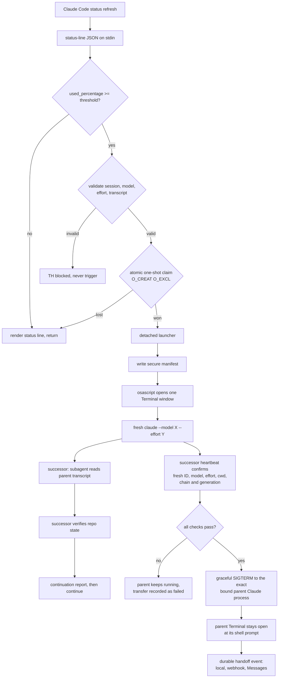

# Terminal Handoff

**A macOS automation for Claude Code that opens a fresh successor Terminal session when the current session reaches a configurable context threshold.**

When your session fills up, Terminal Handoff opens a new Terminal window running a genuinely fresh Claude Code session that:

- is named after the original session and its generation: `Ranger` hands off to `Ranger 2`, then `Ranger 3`
- starts in the **same working directory**
- uses the **same model**
- uses the **same supported effort level**
- receives a **fresh session ID** and a clean context window
- reads a **secure handoff manifest**
- analyses the parent transcript through an **isolated subagent**, not in its own context
- **independently verifies** repository state before trusting anything
- continues authorised work
- sends a durable local alert, with optional signed-webhook and Messages/SMS routing
- can later hand off to another generation, indefinitely

Once the successor has proved it started correctly, the parent Claude session is asked to exit gracefully, so exactly one session continues the work. Its Terminal window stays open at a shell prompt, and if the successor cannot be verified the parent keeps running. Unrelated Claude sessions and Terminal windows are never touched.

---

## The problem

A long Claude Code session eventually fills its context window. What happens next is usually one of two bad outcomes: the session compacts and quietly loses the detail you were relying on, or you start a new session by hand and spend ten minutes re-explaining where you were.

Neither is good when the work is halfway through a refactor, a migration, or a debugging session with a lot of hard-won state.

## Why compaction is not a handoff

Compaction and a fresh-session handoff solve different problems.

| | Compaction | Terminal Handoff |
|---|---|---|
| Session identity | same session, same ID | **new session, new ID** |
| Context window | same window, rewritten | **clean window** |
| What survives | a model-written summary of the conversation | a **manifest of facts** plus a **verified** repository snapshot |
| Prior claims | inherited as narrative, hard to distinguish from fact | explicitly re-verified against the live filesystem and Git |
| Failure mode | silent detail loss, and it happens again shortly after | none: a clean window starts near zero |
| Old transcript | already in context | read by a **subagent**, never loaded into the successor's context |

Compaction rewrites the past. Terminal Handoff hands over a **checkable brief** and makes the successor prove the state for itself. The successor is told, explicitly, to treat the live filesystem and Git state as authoritative wherever they disagree with the transcript, and never to claim work is complete merely because its parent claimed it was.

---

## How it works

Claude Code runs a configured `statusLine` command on every status refresh and passes it the official status-line JSON on stdin. Terminal Handoff **is** that command.



The status line stays responsive: below the threshold it parses JSON, renders, and returns. All expensive work — Git capture, manifest building, the Terminal launch — happens in a **detached** process that outlives the short-lived status-line invocation.

See [docs/ARCHITECTURE.md](docs/ARCHITECTURE.md) for the full state machine.

---

## Requirements

- **macOS** (tested on macOS 15)
- **Apple Terminal** — the only terminal this release supports
- **Claude Code** with `--model` and `--effort` support (developed against 2.1.234)
- **Python 3.9+** — the macOS system Python is sufficient; there are no third-party dependencies
- `osascript` (ships with macOS) and Automation permission to control Terminal
- optional: Messages permission and iPhone Text Message Forwarding for direct SMS/RCS relay

## Supported environment

| | Status |
|---|---|
| macOS + Apple Terminal | Supported |
| iTerm2, Ghostty, WezTerm, Warp, tmux | **Not implemented** |
| Linux, Windows/WSL | **Not implemented** |
| Claude Code | Supported |
| Codex or any other agent CLI | **Not implemented and not verified** |

---

## Installation

```sh
git clone https://github.com/aegis-systemsv1/terminal-handoff.git Terminal-Handoff
cd Terminal-Handoff

./install.sh              # dry run: prints every proposed change, changes nothing
./install.sh --apply      # install, with a confirmation prompt
```

The installer checks macOS, Python 3.9+, Claude Code, `--model`/`--effort` support, `osascript` and Apple Terminal, and **fails closed** if any prerequisite is missing. It backs up every file before modifying it, merges into your existing `~/.claude/settings.json` without disturbing unrelated keys, validates the resulting JSON, and appends its instructions to `~/.claude/CLAUDE.md` idempotently.

It never modifies a shell startup file, never touches an application repository, and never enables a permission bypass.

### Safe dry run

`./install.sh` with no arguments is always a dry run. It reports exactly what it would install, whether an existing status line would be wrapped, and stops.

### Controlled test procedure

Verify without consuming a real context window:

```sh
# 1. Run the suite (no Terminal window opens, no Claude session starts)
python3 -m unittest discover -s tests -v

# Test the installed local alert after installation
python3 ~/.claude/terminal-handoff/terminal-handoff.py notifications test --channel local

# 2. Simulate a trigger end to end, with the real launcher, in test mode
export CLAUDE_TERMINAL_HANDOFF_TEST_MODE=1
python3 src/terminal_handoff/core.py evaluate < tests/fixtures/at_threshold.json

# 3. When you want a real window, drop test mode and feed a synthetic payload
#    to the installed status-line command. One Terminal window will open.
unset CLAUDE_TERMINAL_HANDOFF_TEST_MODE
```

For a controlled end-to-end test that opens real Terminal windows, stops a real process and starts no Claude session:

```sh
python3 scripts/live-handoff-test.py
```

See [docs/INSTALLATION.md](docs/INSTALLATION.md) for the full procedure and [docs/LIVE_TEST_EVIDENCE.md](docs/LIVE_TEST_EVIDENCE.md) for a recorded run.

---

## Configuration

Handoff behaviour uses environment variables. Notification routing uses the
private `~/.claude/terminal-handoff/notifications.json` file and the
`notifications` CLI. Terminal Handoff is enabled by default at 80% with
unlimited generations; local macOS alerts are enabled by default.

| Variable | Effect | Default |
|---|---|---|
| `CLAUDE_TERMINAL_HANDOFF_DISABLED=1` | Kill switch: never trigger | unset |
| `CLAUDE_TERMINAL_HANDOFF_THRESHOLD=75` | Trigger percentage | `80` |
| `CLAUDE_TERMINAL_HANDOFF_TEST_MODE=1` | Simulate; never open a Terminal | unset |
| `CLAUDE_TERMINAL_HANDOFF_MAX_GENERATIONS=10` | Stop after generation N | unlimited |
| `CLAUDE_TERMINAL_HANDOFF_MIN_OBSERVATIONS` | Stability readings required before triggering | `2` |
| `CLAUDE_TERMINAL_HANDOFF_COOLDOWN` | Seconds between launches | `45` |
| `CLAUDE_TERMINAL_HANDOFF_STORM_MAX` | Launches allowed per window | `3` |
| `CLAUDE_TERMINAL_HANDOFF_STORM_WINDOW` | Storm window, seconds | `600` |
| `CLAUDE_TERMINAL_HANDOFF_CIRCUIT_SECONDS` | How long the breaker stays open | `1800` |
| `CLAUDE_TERMINAL_HANDOFF_HOME` | State directory | `~/.claude/terminal-handoff` |
| `CLAUDE_TERMINAL_HANDOFF_CLAUDE_BIN` | Override the `claude` executable | auto-detected |
| `CLAUDE_TERMINAL_HANDOFF_STOP_PARENT=0` | Never stop the parent session after a handoff | enabled |
| `CLAUDE_TERMINAL_HANDOFF_HEARTBEAT_TIMEOUT` | Seconds to wait for a verified successor heartbeat before giving up and leaving the parent running | `300` |
| `CLAUDE_TERMINAL_HANDOFF_STOP_GRACE` | Seconds to wait for the parent to exit after each `SIGTERM` | `20` |
| `CLAUDE_TERMINAL_HANDOFF_STOP_ATTEMPTS` | `SIGTERM` requests before giving up (never escalates) | `2` |
| `CLAUDE_TERMINAL_HANDOFF_STOP_DRY_RUN=1` | Run the whole shutdown path but send no signal | unset |
| `CLAUDE_TERMINAL_HANDOFF_DISABLE_NOTIFICATIONS=1` | Leave events queued but do not spawn the delivery worker | unset |
| `TERMINAL_HANDOFF_PRESENCE` | Routing state: `home`, `away`, or `unknown` | presence file, then `home` |
| `TERMINAL_HANDOFF_WEBHOOK_SECRET` | Ephemeral webhook HMAC secret; Keychain is preferred | unset |

Every `CLAUDE_TERMINAL_HANDOFF_*` variable set when a handoff is triggered is carried into the successor's Terminal window, so a chain keeps the configuration you started it with.

See [docs/NOTIFICATIONS.md](docs/NOTIFICATIONS.md) for local alerts, macOS
Messages/SMS relay, signed webhooks, presence routing, retry and Keychain setup.

> The status-line process inherits the environment of the Claude Code session that started it. Exporting a variable in one shell does **not** affect sessions that are already running. Set it before starting `claude`, or restart the session. Terminal Handoff does not edit your shell startup files; see [docs/CONFIGURATION.md](docs/CONFIGURATION.md) if you want a setting to persist.

---

## Same model, same effort

The successor is launched with the outgoing session's exact values, taken from the live status-line JSON:

```sh
claude --model "<exact .model.id>" --effort "<exact .effort.level>" --name "<base name> <generation>" "<bootstrap prompt>"
```

There is **no silent fallback**. Terminal Handoff will never substitute a cheaper model, a faster model, a default model, Sonnet for Opus, Opus for Sonnet, or a different effort level. If the reported model or effort cannot be launched, it logs the exact reason, shows a visible warning in the status line, leaves the outgoing session fully operational, and permits a bounded retry after a cooldown.

Model IDs are treated as untrusted input, allow-listed, and passed as **separate argv elements** — never as shell text. Bracketed IDs such as `claude-opus-5[1m]` survive intact; the brackets are a genuine shell hazard under zsh.

`.effort` is optional in the status-line schema: it is present only when the model exposes reasoning effort. When it is genuinely absent, `--effort` is omitted, and that fact is recorded in the manifest and the log. No effort level is ever invented.

## Successor naming

The successor keeps your session's name and adds its generation number:

```
Ranger      ->  Ranger 2   ->  Ranger 3   ->  Ranger 4
Nova Drone  ->  Nova Drone 2
```

The original generation-one session keeps its name exactly as it is; no `1` is ever appended. The name applies to both the Claude session name and the Terminal window title.

Three rules make this dependable:

1. **The base name is captured once**, from `.session_name` in the official status-line JSON, when the chain is created. It is then stored as explicit chain metadata under `~/.claude/terminal-handoff/chains/` and reused for every later generation. Renaming a successor mid-chain does not rewrite the chain's base name.
2. **The generation number comes from trusted chain state**, not from the visible name. Terminal Handoff never parses trailing digits off a session name, so a session legitimately named `Project 42` hands off to `Project 42 2` rather than `Project 43`.
3. **The internal chain identifier is never shown.** `chain_id` remains a machine-safe hex string used for state keying; it never appears as a session name. Names such as `terminal-handoff-7a282bd6-g2` are gone.

A session name is untrusted text. It is stripped of control characters, collapsed to single spaces, prevented from beginning with `-`, and bounded to 64 characters — then passed as a single argv element and escaped for AppleScript. Unicode is preserved. Shell metacharacters cannot become commands.

If no session name is available at all, Terminal Handoff uses the documented fallback `Terminal Handoff <first 8 characters of the chain id>` — it never invents a repository, directory or project name.

## The parent session stops, once the successor is proved

Two agents working in the same repository at once is worse than a full context window. So after a successor is launched there is exactly one transfer-of-ownership boundary.

```
LAUNCHING  ->  SUCCESSOR_VERIFIED  ->  PARENT_STOP_REQUESTED  ->  TRANSFER_COMPLETE
     |                  |                        |
     +------------------+------------------------+---------->  TRANSFER_FAILED
```

`LAUNCHING` and `SUCCESSOR_VERIFIED` mean the **parent** owns continuation.
`PARENT_STOP_REQUESTED` is deliberately quiescent: neither session may mutate
while the parent can still be alive. Only `TRANSFER_COMPLETE`, after the exit is
confirmed, gives the **successor** ownership. Transitions are atomic, recorded
with a reason, and refused if illegal. The supervisor uses a kernel-released
lease and is respawned by later status refreshes if it crashes.

The successor is only verified when **all** of these hold, proved from its own live status-line JSON across two heartbeats:

- a fresh session ID, different from the parent's and not already used elsewhere in the chain
- the required model
- the required effort level (including "no effort level" when the parent had none)
- the required working directory
- the correct chain ID
- the correct generation
- its own live context percentage

If any check fails, or no verified heartbeat arrives within the timeout, the parent is **left fully operational**, the transfer is recorded as `TRANSFER_FAILED` with the exact reason, and the failure is logged. Terminal Handoff never marks a transfer complete that it could not prove.

### How the exact parent process is identified

The Claude Code session process is bound at trigger time, from inside the status-line process — the only place its real ancestry is visible. Claude Code runs the status line through a shell, so the ancestry is traced with `ps` rather than assumed: the immediate parent is not the Claude process.

The binding records the PID, the process start time, the controlling terminal, the UID, the executable name, the process working directory, the session ID, the chain ID and the generation. Immediately before any signal is sent, every one of those is re-proved. A reused PID, a renamed executable, a different terminal, a different user or a moved working directory all abort the shutdown with the parent left running.

Terminal Handoff does **not** use `pkill`, `killall`, process-name pattern matching, process groups, unverified PID files, Terminal front-window assumptions or generated shell commands. It sends exactly one signal type — `SIGTERM` — to exactly one PID, at most twice, and **never escalates to `SIGKILL`**. If the parent does not exit, that is recorded and logged as a visible failure rather than forced.

The parent's Terminal window and its shell are never signalled: the window remains open at its shell prompt.

## Notifications and out-of-office alerts

Every `TRANSFER_COMPLETE` or `TRANSFER_FAILED` transition creates one
idempotent event in a private durable outbox. State commits first, so an alert
failure can never roll back or delay a handoff. Successful channels are not
repeated while another channel retries.

- Local Notification Center alerts are on by default.
- A generic HTTPS webhook is HMAC-signed and carries an idempotency key, so a
  private presence-aware gateway can route to web push, SMS, Messenger, Slack,
  Signal or another provider.
- The optional Messages adapter can send an iMessage or use the iPhone's Text
  Message Forwarding for SMS/RCS when presence is `away`.
- Transcript contents and paths, prompts, repository paths, environment dumps
  and secrets are never included in outbound events.

```sh
TH="$HOME/.claude/terminal-handoff/terminal-handoff.py"
python3 "$TH" notifications status
python3 "$TH" notifications test --channel local
python3 "$TH" notifications presence --presence away
```

Full setup and routing policy: [docs/NOTIFICATIONS.md](docs/NOTIFICATIONS.md).

## The continuous generation loop

```
Session 1 at threshold  →  Session 2   (same model, same effort)
Session 2 at threshold  →  Session 3
Session 3 at threshold  →  Session 4   …  until explicitly disabled
```

Two rules that sound similar but are not:

- **One trigger per session.** A session can hand off exactly once.
- **Unlimited generations per chain.** Every successor is itself monitored and may hand off once, so the chain continues indefinitely.

The one-shot marker is keyed by `session_id`, never by PID, working directory, repository name or generation number, so a successor never inherits its parent's claim. Set `CLAUDE_TERMINAL_HANDOFF_MAX_GENERATIONS` if you want a ceiling.

## Duplicate-trigger protection

The trigger is claimed with an atomic `O_CREAT|O_EXCL` file creation. Concurrent status-line processes racing on the same session produce **exactly one** launch; every loser sees the claim already taken and renders `TH handed off`.

## Circuit breaker

A successor could, in principle, trigger immediately — from a stale reading, an inherited percentage, a double invocation or a malformed manifest. Five independent guards prevent that:

1. Each successor has a different session ID and its own one-shot marker.
2. Trigger decisions use only that session's own live status JSON.
3. A session must produce at least `MIN_OBSERVATIONS` (default 2) of its **own** non-null percentage readings before it is eligible.
4. A launch cooldown (default 45s) applies between launches.
5. A storm circuit breaker trips after 3 launches in 10 minutes, suspends launching for 30 minutes, logs the event and shows `TH circuit open`. It is never hidden, and `reset-circuit` clears it.

## Transcript isolation

An 80%-full parent transcript would consume most of a fresh successor's context and trigger another handoff almost immediately. So the successor never reads it directly.

The successor is instructed to delegate transcript analysis to a temporary subagent. The subagent reads the JSONL; the main session receives only a concise structured continuation brief (normally well under 4,000 words). In the reference live test, the parent transcript was 26,180 characters and **zero** of its raw content entered the successor's main context.

## Security boundaries

- No `eval`. No sourcing of generated content. No clipboard handover.
- The transcript is validated (absolute, exists, regular file, readable, non-empty, no traversal, parses as JSONL) and then referenced **by path only**. It is never executed, never interpolated into a shell command, never passed as an argument, and never logged.
- Model IDs allow-listed to `[A-Za-z0-9._:@/\[\]-]`; effort allow-listed to five values; paths bearing `"`, `\` or control characters rejected outright; everything else quoted with `shlex.quote` and escaped for AppleScript.
- Manifests, logs and prompts are `0600`; every directory is `0700`.
- Manifests record no credentials, tokens, environment dumps, file contents, transcript contents or shell history.
- The successor runs in your normal permission mode. Terminal Handoff never passes `--dangerously-skip-permissions` and never runs a destructive Git command.

If a status line already exists, Terminal Handoff runs it through `/bin/sh -c` — the same way Claude Code already does. It is fixed at install time from your own settings, and no status JSON, transcript content, model ID, effort value or manifest data can alter it. Read [**The `--wrap` mechanism**](docs/SECURITY_MODEL.md#the---wrap-mechanism-read-this-before-installing) before installing over an existing status line.

See [docs/SECURITY_MODEL.md](docs/SECURITY_MODEL.md) for the full threat model.

## Wrapping an existing status line

If you already have a status line, Terminal Handoff **wraps** it rather than replacing it: it runs your command with the identical stdin bytes and preserves its stdout byte-for-byte, appending only a short badge.

```
<your existing status line, unchanged> · TH 42%
```

| Badge | Meaning |
|---|---|
| `TH 42%` | Monitoring; context at 42% |
| `TH ready` | Monitoring; percentage not yet reported |
| `TH launching` | Threshold reached; successor being opened |
| `TH handed off` | This session has already handed off |
| `TH retrying` | Launch cooldown active |
| `TH blocked` | Validation failed; no launch will occur |
| `TH circuit open` | Storm breaker tripped |
| `TH disabled` | Kill switch set |

Project-level settings override user-level settings, so any repository defining its own `statusLine` must be integrated explicitly. `coverage` reports exactly which configurations are covered:

```sh
python3 src/terminal_handoff/core.py coverage
```

## Rolling back

To undo just the parent-shutdown behaviour without changing versions, set
`CLAUDE_TERMINAL_HANDOFF_STOP_PARENT=0` before starting `claude`. To restore a
previous runtime, or to remove Terminal Handoff entirely, see
[docs/INSTALLATION.md](docs/INSTALLATION.md#rolling-back).

## Uninstallation

```sh
~/.claude/terminal-handoff/uninstall.sh            # dry run
~/.claude/terminal-handoff/uninstall.sh --apply
```

Restores any pre-existing status line exactly, removes the instruction block from `~/.claude/CLAUDE.md`, validates the resulting JSON, and preserves manifests, logs and backups. Transcripts and repositories are never touched. See [docs/UNINSTALLATION.md](docs/UNINSTALLATION.md).

## Troubleshooting

Start with `status` and the log:

```sh
python3 src/terminal_handoff/core.py status
tail -20 ~/.claude/terminal-handoff/logs/terminal-handoff.log
```

Common cases are covered in [docs/TROUBLESHOOTING.md](docs/TROUBLESHOOTING.md): no status line appearing, `TH blocked`, no Terminal window opening, the Automation permission prompt, and clearing the circuit breaker.

---

## Known limitations

Stated plainly, because overstating them would make this tool untrustworthy.

1. **`ultracode` cannot be preserved.** `claude --effort ultracode` is accepted by the CLI but resolves to `xhigh` plus a separate internal boolean that the status-line JSON never exposes. A parent running ultracode reports `xhigh`, so the successor starts at `xhigh`. Every manifest records `effort.ultracode: "undetectable"`. No value is invented.
2. **Only effort values exposed through official status-line data are preserved** — `low`, `medium`, `high`, `xhigh`, `max`.
3. **Model validity cannot be checked before launch.** `claude --model <invalid>` exits 0 at argument-parse time and only fails when the session starts. A launch is therefore recorded as `launched`, not `completed`, until the successor's own heartbeat confirms its model, effort, working directory and fresh session ID.
4. **A genuine, natural 80% live trigger has not been exercised**, because reaching it legitimately consumes roughly 160,000 tokens of context. Threshold logic is tested against synthetic payloads built from the official schema. What *was* live-tested: the real Terminal launch, the fresh session, model preservation, effort preservation, the working directory, transcript isolation, repository verification and the successor heartbeat.
5. **A project-level `statusLine` overrides the global one**, and must be integrated explicitly. Run `coverage` after adding one.
6. **Apple Terminal only.** Other terminal emulators are not implemented.
7. **Claude Code only.** Codex and other agent CLIs are **not implemented and not verified**.
8. **Claude Code auto-updates.** If a future version renames a status-line field, Terminal Handoff fails closed — `TH blocked`, never a wrong trigger. Re-run the suite after a major upgrade.
9. **Automation permission is required.** If macOS Automation access to Terminal is revoked, launches fail with a logged reason and the outgoing session stays fully operational.
10. **The parent is only stopped when its process can be proved.** If the Claude Code process cannot be bound from the status line's ancestry — an unusual host setup, a Claude process further than six levels away, or one whose working directory does not match the session's — the handoff still happens and the parent is simply left running. That is the safe direction, but it means two sessions can briefly coexist; the successor is told not to mutate anything until the transfer state authorises it.
11. **A parent that ignores `SIGTERM` is not forced.** There is no `SIGKILL` path. If the parent does not exit within the grace period, the transfer is recorded as failed and you close the session yourself.
12. **Renaming a session mid-chain does not rename the chain.** The base display name is captured once, at generation 1, and is deliberately immutable thereafter.

Terminal Handoff **does not** bypass Claude Code permissions, **does not** close the original Terminal window, and **does not** execute transcript contents. It does stop the original Claude *session*, but only the exact process it bound and only after the successor has been verified.

## Development and testing

```sh
python3 -m unittest discover -s tests -v      # full suite
python3 tests/test_detector.py                # one module
```

The suite runs entirely against synthetic status-line fixtures in isolated temporary directories. It opens no Terminal window, starts no Claude session, consumes no context window and modifies no real repository — Git tests build throwaway repositories under `/tmp`.

See [docs/DEVELOPMENT.md](docs/DEVELOPMENT.md),
[docs/ARCHITECTURE.md](docs/ARCHITECTURE.md) and the
[decision records](docs/decisions/0002-exclusive-ownership-and-notification-outbox.md).

## Version

**1.2.0** — see [CHANGELOG.md](CHANGELOG.md).

## Licence

MIT — see [LICENSE](LICENSE).

Terminal Handoff is an independent project, **not affiliated with, endorsed by, or sponsored by** Anthropic, Claude, Apple or OpenAI. See [NOTICE.md](NOTICE.md) for trademark attribution and third-party code status.
