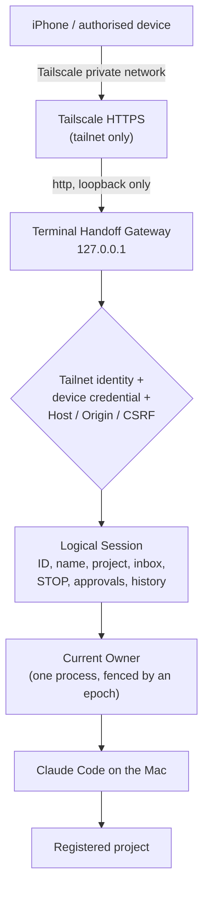
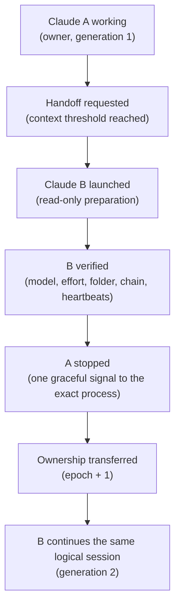
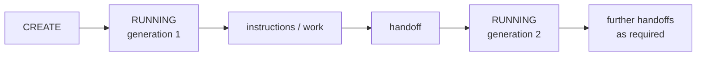
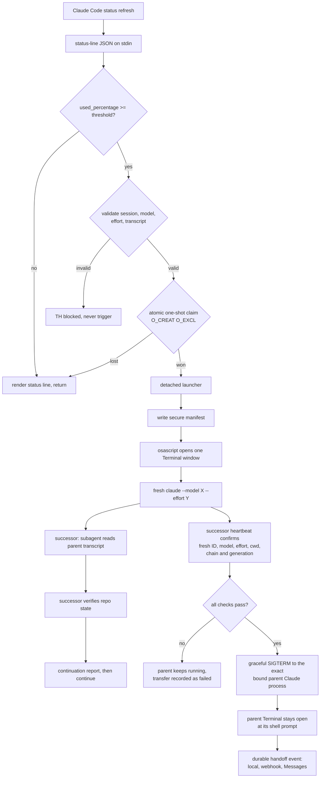

# Terminal Handoff

**A persistent session-control and handoff system for Claude Code on macOS.**

Terminal Handoff lets one Claude Code *task* outlive any single Claude session. When a session fills its context window, ownership of the task is transferred automatically to a fresh successor that continues the same work. The task is also securely controllable from an enrolled iPhone (or another authorised device) over a private Tailscale network, while the actual Claude Code process keeps running on your Mac, inside a project you registered, under your own Claude login.

The idea that ties it together: a **logical session** is the persistent thing (its ID, name, project, instruction queue, STOP state, approvals and history), and individual Claude processes are **replaceable workers** underneath it. A phone talks to the logical session, never to a process, so it keeps controlling the right worker across every handoff.

> **Version 1.4.0.** Physical iPhone acceptance was completed on 2026-09-20. See [Acceptance evidence](#acceptance-evidence) and [Known limitations](#known-limitations).

## Contents

[What it can do](#what-terminal-handoff-can-do) · [Architecture](#architecture) · [Session lifecycle](#remote-session-lifecycle) · [Automatic handoff](#automatic-handoff) · [Control from an iPhone](#remote-control-from-iphone) · [Security model](#security-model) · [Projects](#project-registration) · [Naming](#session-naming) · [STOP / resume](#stop--resume) · [Approval gates](#human-approval-gates) · [Recovery](#recovery) · [Install and set up](#installation-and-setup) · [CLI reference](#cli-reference) · [Acceptance evidence](#acceptance-evidence) · [Limitations](#known-limitations) · [Troubleshooting](#troubleshooting) · [Local handoff in detail](#local-handoff-in-detail)

---

## What Terminal Handoff can do

**Start and steer Claude from your phone**

- Start a Claude Code session remotely from an iPhone, choosing only from **explicitly registered, authorised projects**.
- Give a new session a **custom name**, and **rename** an existing logical session later.
- Run Claude Code **on the Mac** while controlling it from the phone.
- **Keep working when the phone disconnects**; reconnect later and see the **same logical session**, its current state and recent output.
- **Send new instructions remotely.** They are queued durably and delivered, in order, to the current Claude owner.
- **Pause**, **STOP** and **resume** a session from the phone.

**Hand off automatically**

- **Hand off automatically from Claude session A to successor B** when context fills, and **continue the task automatically** afterwards.
- Preserve the **same logical session identity**, the **custom name**, and the **queued instructions** across handoffs.
- Preserve your **selected Claude operating mode (including Auto Mode)** for remotely launched sessions and their successors.
- Track **generation and ownership**, guarantee **one current logical owner (a sole writer)**, and **reject stale predecessor sessions**.

**Stay safe**

- **STOP** blocks queued work from executing; it persists; only a deliberate resume **with a reason** clears it, and the queue then runs in order.
- Terminal Handoff **human approval gates**, bound to the right session, action and owner generation; **stale, forged or replayed approvals are rejected**. An agent cannot approve its own gate.
- **Detect dead owners** and move dead or unverifiable sessions to **ORPHANED** rather than silently relaunching them.
- **Recover safely from a gateway restart**, and recover from an **orphaned automatic-handoff claim**.
- Monitor **Claude Remote Control health** and report a **degraded** state.
- Keep an **audit history** of important session actions.

**Mobile experience**

- Mobile-friendly iPhone controls; text **drafts and focus are preserved** while the page polls, and **native iOS copy/paste works**.

**Access and containment**

- Use **registered project paths**, never arbitrary paths from the phone; remote projects are **opt-in**, and a new project needs Claude's normal **one-time folder trust**.
- Remote access is **private through Tailscale** (no Funnel, loopback-only gateway), and additionally requires an **enrolled, revocable device credential**.

---

## Architecture



The phone never reaches a Claude process directly. It reads and changes the **logical session**; Terminal Handoff decides who the current legitimate owner is and only that owner can take instructions.

### How a handoff moves ownership



The **logical session is persistent; Claude processes are replaceable workers.** Its ID, custom name, instruction queue, STOP state, approvals and history all belong to the logical session, so none of them changes when the worker does.

---

## Remote session lifecycle



Exceptional states:

| State | Meaning |
|---|---|
| `CREATING` | The Mac has accepted the request and is launching Claude. It becomes `RUNNING` only when the launched Claude has registered as owner. |
| `RUNNING` | A verified owner is working (or waiting for instructions). |
| `PAUSED` | You paused it. Nothing is delivered until you resume. |
| `STOPPED` | You stopped it. See [STOP / resume](#stop--resume). |
| `WAITING_FOR_HUMAN` | The agent stopped at a Terminal Handoff approval gate and is waiting for your decision. |
| `ORPHANED` | The owner stopped responding for long enough to be judged dead. It is **not** relaunched automatically; you re-check or abandon it. |
| `FAILED` | It could not start, or you abandoned it. |
| `COMPLETED` | The session ended normally. |

Remote Control health (`healthy`, `degraded`, `disabled`, `unknown`) is reported separately from state: a degraded remote channel never stops a healthy session.

---

## Automatic handoff

1. **Trigger.** Claude Code runs Terminal Handoff as its status line. When the session's context reaches the threshold (**production default: 80%**, `CLAUDE_TERMINAL_HANDOFF_THRESHOLD`) the trigger claims a one-shot marker for that session.
2. **Successor launch.** A detached launcher opens a fresh Claude session with the same model, effort and working directory (and, for remote sessions, the same permission settings and mode).
3. **Verification.** The successor prepares read-only. Two valid heartbeats must prove a fresh session ID, the required model and effort, the required folder, and the correct chain and generation.
4. **Sole-owner transfer.** Only then is the parent asked to exit, with one graceful `SIGTERM` to the exact process bound at trigger time. `TRANSFER_COMPLETE` makes the successor the sole owner, and the logical session's ownership **epoch** increases by one.
5. **Continuation.** The successor adopts the logical session, verifies Remote Control, inherits the unread instructions, STOP state and any pending approval, and **continues the task automatically**. It stops only at a genuine human gate.
6. **Stale-owner rejection.** Every inbox read, acknowledgement, approval use and wait is fenced by the current epoch, so a predecessor is refused.
7. **Orphaned-claim recovery.** If the status-line process dies after claiming but before launching, the orphaned claim is recovered automatically (only if it is old, its claimant is gone and nothing launched), bounded to three attempts.

The threshold is a **production setting of 80%**. A lower value exists only as a test override (`CLAUDE_TERMINAL_HANDOFF_THRESHOLD`); it is not how Terminal Handoff behaves normally. The full local-handoff mechanics are in [Local handoff in detail](#local-handoff-in-detail) and [docs/ARCHITECTURE.md](docs/ARCHITECTURE.md).

---

## Remote control from iPhone

1. Connect the iPhone to the same authorised **Tailscale** network as the Mac.
2. Open the private Terminal Handoff HTTPS address: `https://<terminal-handoff-host>:<port>/`
3. **Enroll the device once** with a one-time code from the Mac (`remote enroll-device`).
4. Tap **+ New Session**.
5. Choose an **authorised project** (only projects you enabled for remote launch appear).
6. Optionally **name** the session.
7. Enter the task and tap **Start Session**.
8. **Monitor** status, owner generation, Remote Control health and the **transcript**.
9. **Send further instructions** ("Tell Claude…").
10. **Rename**, **Pause**, **STOP** or **Resume** when required.
11. **Disconnect and reconnect** at any time; the logical session is unaffected.

When the phone disconnects, **nothing changes** for the session. Claude keeps working unless the session is STOPPED or paused, is waiting at a gate, has finished, or has failed. On reconnect the page shows the authoritative current state.

### Reading the transcript

The session page shows one scrollable history for the **logical** session, not for whichever Claude process happens to own it: Claude's output and the lifecycle events in one ordered list, with generation boundaries marked (`— Handoff complete — generation 2 became owner —`) rather than hidden. Individual processes are replaceable; the history is not.

- **At the bottom, it follows.** New output stays in view as it arrives.
- **Scroll up and it holds still.** Auto-scroll stops the moment you scroll, and incoming output can neither drag you back down nor shift the lines you are reading. It keeps arriving in the background.
- **You are told what you missed.** A **"N new updates ↓"** pill appears while you are reading older output. Tap it, or **↓ Latest**, to return to the newest line and resume following.
- **Older history loads as you need it.** Scrolling to the top fetches the previous page. Retention is bounded (2000 lines per session, 100 lifecycle events), so neither the record nor the page grows without limit.

The transcript is appended to, never rebuilt, which is what keeps the instruction box's focus, draft, selection, the iOS keyboard and native iOS paste stable while it updates.

### Clearing out old sessions

The list is grouped into **Active sessions**, **Recent / closed** and **Archived**, with the session's own name first and its project underneath.

A finished session (`COMPLETED`, `FAILED`, `ORPHANED`) offers **Remove session**, which asks *"Remove this session from Terminal Handoff history?"* before doing anything, and can be undone with **Restore**.

**What removal does and does not do.** It is a soft delete of *Terminal Handoff's own record*: the session is hidden from the normal lists, while its record, name, project and audit history are kept. It does **not** delete your project, its files or its repository, does not run any Git command, does not end any Claude process, and does not touch any other logical session.

An **active** session (`RUNNING`, `WAITING_FOR_HUMAN`, `PAUSED`, `STOPPED`, `CREATING`) has no removal control at all — STOP and the recovery controls remain the only way to end work — and the gateway refuses removal for any session whose owner is still verified alive, whatever the phone asks.

> Documentation screenshots must never contain a real hostname, enrollment code, credential, personal path or private project. See [docs/screenshots/README.md](docs/screenshots/README.md).

---

## Security model

Terminal Handoff's own authority layer is separate from Claude's permission system, and the two should not be confused (see below).

**Network and identity**

- **Tailscale private network only.** **No Funnel.** The gateway binds **loopback only** (`127.0.0.1`) and refuses to start otherwise; Tailscale provides the **HTTPS** front end.
- Startup **fails closed** if Tailscale is not running, the Mac's tailnet name is not the configured host, or the gateway's local port is already published by another Tailscale mapping.
- A request must come from an allowed **tailnet identity** **and** carry an enrolled **device credential**.
- **Device enrollment** uses a **short-lived (10 minute), single-use code**. Device credentials are stored only as hashes, are **revocable** and expire (14 days by default).
- **Strict Host and Origin** handling (with the public port), **CSRF** protection for cookie sessions, JSON-only bodies, and **rate limiting with persistent lockout**.

**What the phone can and cannot do**

- **Project registry with pinned real paths.** The phone sends a project *name*; Terminal Handoff resolves it, and a swapped symlink is refused. **No arbitrary path** is ever accepted.
- **No arbitrary shell-command API.** There is no endpoint that accepts a command, a path or a process ID, and request bodies are whitelisted.
- Remote projects are **opt-in** and need a **validated permission profile** ("fail closed": no valid profile, no unattended launch).

**Ownership and control**

- **Logical owner verification, process binding and sole-writer protection:** one owner at a time, fenced by an epoch, with the process identity re-proved before any signal.
- **STOP** is independent of Claude's task flow and cannot be cleared by the agent.
- **Approval replay protection:** approvals are bound to session, request, exact action, owner epoch, nonce and expiry, and are one-shot.
- **Audit events** for creation, instructions, ownership changes, approvals, STOP/resume, rename, recovery and failures. Secrets are never logged.

**Terminal Handoff versus Claude's own permissions**

Terminal Handoff never passes `--dangerously-skip-permissions` or any permission flag on the command line, and never answers a native Claude permission prompt (there is no supported way to, and it does not type into terminals). Your chosen Claude mode, including **Auto Mode**, is carried unchanged into remote sessions and their successors. **Auto Mode is not an operating-system sandbox**: in Auto Mode Claude's own classifier makes most permission decisions, so a project's permission profile is a narrower *default* rather than a hard boundary. Terminal Handoff's own gates, STOP and project registry stay in force regardless of mode.

Full threat model: [docs/SECURITY_MODEL.md](docs/SECURITY_MODEL.md) and [docs/REMOTE_CONTROL.md](docs/REMOTE_CONTROL.md#threat-model).

---

## Project registration

**Real projects are never exposed automatically.** Each is opted in, deliberately:

```
register project
  -> verify the pinned realpath
  -> establish and validate a permission profile
  -> trust the folder once in Claude (if it has not been trusted)
  -> explicitly enable remote launch
  -> the project becomes available on the phone
```

```sh
th() { /usr/bin/python3 "$HOME/.claude/terminal-handoff/terminal-handoff.py" "$@"; }   # installed runtime

th project add my-app "$HOME/code/my-app"          # registers a NAME; the real path is pinned
th project list                                    # shows path, enabled, remote launch, profile status
th project permissions template my-app > profile.json     # a starting point; nothing is applied
$EDITOR profile.json                                      # allow / deny / human_gate lists
th project permissions edit my-app --from-file profile.json
th project permissions validate my-app                    # must say: valid

( cd "$HOME/code/my-app" && claude )    # accept "Yes, I trust this folder" ONCE, then /exit
th remote verify-isolation              # once per Claude version (see Install)
th project enable-remote my-app         # only succeeds with a valid profile
```

The phone lists only projects with remote launch enabled. **Folder trust is a manual, one-time prerequisite** that Terminal Handoff cannot and does not answer for you: until you accept Claude's trust question in that folder, a remote start reports `FAILED` and the Terminal window shows the trust prompt. Editing a profile disables remote launch until you re-enable it.

---

## Session naming

- An **optional name** can be given when creating a session from the phone; blank keeps the default label.
- **Rename** any session from its page (the panel opens at the top, under the title).
- The name is **display metadata only**. It never changes the logical session ID, owner, epoch, process binding, project, permissions, inbox, approvals, STOP state or handoff chain.
- It **persists** across page refreshes, phone reconnects, gateway restarts and **every handoff**.
- Names are 1-60 characters (letters, numbers, spaces and `. , ' & ( ) + # : ! ? -`); anything that looks like a path, command or identifier is refused. Each rename is audited with the old and new name.

---

## STOP / resume

STOP is a **Terminal Handoff control that is independent of Claude's normal task flow.**

**STOP**

- **Blocks instruction delivery and execution**: new instructions are accepted and queued but not handed to the agent.
- **Persists** in the logical session, so it survives handoffs and gateway restarts.
- **Cannot be cleared by the agent itself**; the agent's commands cannot resume, decide or clear anything.
- Needs a **deliberate human resume**.
- **Queued work remains queued.**
- Optionally also ends the Claude process with one graceful signal (`hard`), sent only after the process identity is re-proved.

**Resume**

- Clearing a STOP requires a **human reason** (a plain resume is refused while stopped).
- It clears STOP and **releases queued instructions in their original order**.
- The agent is told to keep waiting while halted, so a resume reaches it.

Pause works the same way but is a lighter hold.

---

## Human approval gates

There are two different things:

| | What it is | Who answers |
|---|---|---|
| **Terminal Handoff human gate** | An authority boundary the agent *chooses to stop at* (for example a production deployment). It appears on the phone as **APPROVAL REQUIRED** with the exact action and reason. | You, from the phone or the Mac. |
| **Claude native permission prompt** | Claude Code's own tool-permission dialog. | You, in the terminal or in Claude's own Remote Control. Terminal Handoff cannot and does not answer it. |

An **agent cannot approve its own Terminal Handoff gate**. An approval is bound to the session, the approval request, the **exact action**, the **owner generation** and a **nonce**, expires, and can be used **once**. A changed action needs a new approval; stale, forged, duplicate or cross-session approvals are rejected; an approval granted but not yet used does not cross a handoff.

---

## Recovery

- **Gateway restart.** On start the gateway reloads every logical session, revalidates the project, expires stale approvals, and **re-verifies each owner twice**. A session whose owner cannot be verified alive becomes **ORPHANED**, not RUNNING. STOP, the inbox and pending approvals are preserved.
- **Dead-owner detection.** Independent signals (the re-proved process binding, Claude's own session record, a fresh status-line snapshot) are combined; a death must persist for about a minute before `ORPHANED`. A parent being replaced by a handoff is not orphaned.
- **No unsafe automatic relaunch.** An `ORPHANED` session is never replaced automatically. You choose **Re-check** (only succeeds if the owner is verifiably alive) or **Abandon** (`FAILED`).
- **Orphaned automatic-handoff claim.** A trigger that claimed but never launched is recovered automatically, **bounded to three attempts**.
- A Mac **reboot** is not recovered: Claude processes do not survive it, so such sessions become orphaned and are abandoned or restarted by you.

---

## Installation and setup

**Prerequisites:** macOS, Apple Terminal, Python 3.9+ (the system Python is enough; no third-party packages), Claude Code with `--model` and `--effort`, and Automation permission for Terminal. **Remote access additionally needs Tailscale** on the Mac and on the phone (the same account), and Claude Code new enough to support `--remote-control`, `--settings` and `--setting-sources` (developed against 2.1.278).

**1. Install or update the runtime.** Use the project's installer; it never edits shell files and backs up what it changes.

```sh
git clone https://github.com/aegis-systemsv1/terminal-handoff.git Terminal-Handoff
cd Terminal-Handoff
./install.sh              # dry run: shows every change, changes nothing
./install.sh --apply      # installs into ~/.claude/terminal-handoff (asks to confirm)
```

Re-running the installer from an updated checkout updates the runtime. Keep a copy of the previous runtime first (see [Rolling back](#rolling-back)).

**2. Remote gateway (optional).** Commands use the `th` shorthand defined above.

```sh
# a. Verify Claude's per-session permission isolation (once per Claude version)
th remote verify-isolation

# b. Configure the gateway (loopback only) for THIS Mac's tailnet name and YOUR Tailscale login
th remote configure --host <mac>.<tailnet>.ts.net --tailscale-user you@example.com \
   --port 18790 --permission-mode auto        # or default / acceptEdits / plan; never bypass

# c. Register and enable at least one project (see Project registration)

# d. Check, then start (foreground; nothing is published yet)
th remote check         # prints a free HTTPS port and the exact publish command
th remote serve

# e. Publish on its OWN tailnet-only HTTPS port (never `tailscale funnel`)
tailscale serve --bg --https=<free-port> http://127.0.0.1:18790
th remote configure --public-port <free-port>   # then restart `th remote serve`

# f. Health check from a tailnet device
curl https://<mac>.<tailnet>.ts.net:<free-port>/healthz     # {"status": "ok"}
```

**3. Enroll a device.**

```sh
th remote enroll-device --name "My iPhone"      # prints a one-time code (valid 10 minutes)
```

On the phone open `https://<terminal-handoff-host>:<port>/`, choose **Enroll**, enter the code. Manage devices with `th remote list-devices` and `th remote revoke-device --device d_...`.

**4. Stop or roll back the remote service**

```sh
tailscale serve --https=<free-port> off        # unpublish ONLY this mapping
th remote list-devices; th remote revoke-device --device d_...
# stop the `th remote serve` process
th project disable-remote my-app
```

Never run `tailscale serve reset`: it removes **every** serve mapping on the Mac.

### Rolling back

Before updating, copy the runtime (`cp -R ~/.claude/terminal-handoff ~/.claude/terminal-handoff.backup`), or re-run the installer from the previous tag. To undo only the parent-shutdown behaviour set `CLAUDE_TERMINAL_HANDOFF_STOP_PARENT=0`. To remove Terminal Handoff entirely use `~/.claude/terminal-handoff/uninstall.sh --apply` ([docs/UNINSTALLATION.md](docs/UNINSTALLATION.md)). Remote features can be switched off without affecting ordinary local handoffs.

Full procedures: [docs/INSTALLATION.md](docs/INSTALLATION.md), [docs/REMOTE_CONTROL.md](docs/REMOTE_CONTROL.md).

---

## CLI reference

The installed command is `python3 ~/.claude/terminal-handoff/terminal-handoff.py <command>` (shortened to `th` below); from a checkout use `python3 src/terminal_handoff/core.py <command>`.

| Task | Command |
|---|---|
| Runtime status | `th status` |
| Status-line coverage | `th coverage` |
| Version | `th version` |
| Manual handoff (from inside the session) | `th manual-handoff --session-id <id>` |
| Install status line | `th install --settings ~/.claude/settings.json` |
| Notifications | `th notifications status`, `... test --channel local`, `... presence --presence away` |
| **Projects** | |
| List / add / remove | `th project list` · `th project add <name> <abs-path>` · `th project remove <name>` |
| Permission profile | `th project permissions template\|show\|edit\|validate <name>` (`edit --from-file f.json`) |
| Remote launch on / off | `th project enable-remote <name>` · `th project disable-remote <name>` |
| **Remote service** | |
| Configure | `th remote configure --host H --tailscale-user U --port P --public-port PP --permission-mode auto` |
| Health / preflight | `th remote check` |
| Start | `th remote serve` |
| Isolation proof | `th remote verify-isolation` |
| Devices | `th remote enroll-device --name N [--ttl-days D]` · `th remote list-devices` · `th remote revoke-device --device ID` |
| **Sessions** (add `--logical-session ls_...`) | |
| List / show | `th session list` · `th session show` |
| Instruction | `th session post --text "..."` |
| Rename | `th session rename --text "New name"` |
| Pause | `th session pause` |
| STOP (optionally end the process) | `th session stop --reason "..." [--hard]` |
| Resume from pause | `th session resume` |
| Resume from STOP | `th session resume --clear-stop --reason "why it is safe"` |
| Approval decision (human) | `th session decide --approval-id ap_... --decision approve\|deny --nonce N --owner-epoch E` |
| Recovery | `th session recover --recover-action reattach\|abandon` · `th session reconcile [--startup]` |

The commands an agent runs itself inside a session (`session inbox`, `wait`, `ack`, `note`, `check`, `gate`, `consume`, `hook-stop`, and `continuation wait|status|gate|resume|remote-check`) are documented in [docs/REMOTE_CONTROL.md](docs/REMOTE_CONTROL.md). The agent cannot run `decide`, `stop`, `resume`, `pause`, `recover` or `post`.

---

## Acceptance evidence

**Physical iPhone acceptance was completed on 2026-09-20.** Full detail, including the defects found and fixed on the way, is in [docs/ACCEPTANCE.md](docs/ACCEPTANCE.md).

| Check | Result |
|---|---|
| Remote session launch from the iPhone | Passed |
| Disconnect and reconnect | Passed |
| Remote instruction delivery | Passed |
| Automatic A → B handoff | Passed |
| Sole-owner / sole-writer verification | Passed |
| Successor continuation | Passed |
| STOP | Passed |
| Queued work blocked while STOPPED | Passed |
| Deliberate resume | Passed |
| Queued work executed after resume | Passed |
| iOS copy/paste | Passed |
| Session naming and rename | Passed |
| Remote Control healthy across the handoff | Passed |
| Automated suite | **581 tests passed** |
| `scripts/verify-release.sh` | **PASS** |

## Known limitations

Stated plainly. Overstating them would make this tool untrustworthy.

**Remote control and permissions**

1. **Claude's runtime permission mode can change independently.** A launched session started in the default mode and later showed "accept edits on"; Terminal Handoff has no code path that sets a mode other than writing your chosen default, so this is Claude's own behaviour (modes can be cycled at runtime and by clients attached through Remote Control).
2. **Auto Mode permission profiles are not an OS-level sandbox.** An agent that can edit files and run tests can run arbitrary code through a test.
3. **The interactive Stop hook remains unverified.** It works in headless runs; the durable inbox, not the hook, is the delivery guarantee.
4. **A new project requires one-time Claude folder trust**, done manually.
5. **Wake latency varies while Claude is actively working.** Instructions are queued durably and delivered promptly when the agent is waiting; a busy agent sees them at its next check.
6. **Remote project access is deliberately opt-in.**
7. **Mac reboot recovery is not implemented** (service restart recovery is). Relaunching an `ORPHANED` session automatically is deliberately not done.
8. The remote-control health signal is read from Claude's live session record, an implementation detail that is not a documented API, and `--setting-sources` is undocumented; isolation is proven per Claude version with `remote verify-isolation`.
9. Remote sessions do not load project or user settings (including project hooks); `CLAUDE.md` files still load. One active remote session per project.

**Local handoff** (unchanged)

10. **`ultracode` cannot be preserved.** It resolves to `xhigh` plus a hidden flag the status-line JSON never exposes.
11. **Only effort values exposed through official status-line data are preserved** (`low`, `medium`, `high`, `xhigh`, `max`).
12. **Model validity cannot be checked before launch**; a launch is `launched` until the successor's own heartbeat confirms it.
13. **A project-level `statusLine` overrides the global one** and must be integrated explicitly (`th coverage`).
14. **Apple Terminal only**; **Claude Code only**; **macOS only**.
15. **Claude Code auto-updates**: if a status-line field is renamed, Terminal Handoff fails closed (`TH blocked`). Re-run the suite after a major upgrade.
16. **Automation permission is required** for Terminal.
17. **The parent is only stopped when its process can be proved**; otherwise the handoff still happens and the parent is left running. A parent that ignores `SIGTERM` is not forced (no `SIGKILL`).
18. **Renaming a *Claude* session mid-chain does not rename the chain**; the base name is captured once. (Renaming a *logical* session from the phone is separate and changes only the phone label.)

Terminal Handoff **does not** bypass Claude Code permissions, **does not** close the original Terminal window, and **does not** execute transcript contents.

## Troubleshooting

Start with `th status` and the log: `tail -20 ~/.claude/terminal-handoff/logs/terminal-handoff.log`.

| Symptom | What to check |
|---|---|
| **iPhone cannot connect** | Tailscale is on for the phone, same account; the address includes the published port; `th remote check` on the Mac; `curl` the `/healthz` URL from another tailnet device. |
| **Tailscale unavailable** | The gateway refuses to start unless Tailscale is running and the Mac's name matches `--host`. Start Tailscale, then `th remote check`. |
| **Enrollment code expired / rejected** | Codes last 10 minutes and work once. Run `th remote enroll-device` again. Repeated failures lock out temporarily. |
| **Project missing from the phone** | It must be registered, have a valid profile, and have `enable-remote` set. `th project list` shows each state. Editing a profile disables remote launch. |
| **Project not trusted / start reports FAILED** | Open Claude once in that folder (`cd <project> && claude`), accept the trust question, `/exit`, and start again. |
| **Remote Control shows degraded** | The session keeps running. Check `/remote-control` in that session; Terminal Handoff rechecks after each handoff. |
| **Session seems stuck at generation 1** | The threshold may not be reached (default 80%). If the log shows `trigger_claimed` but no launch, a stale claim is recovered automatically after about 45 s (up to three times). |
| **Automatic handoff claim** | `stale_trigger_claim_released` in the log means recovery ran; nothing to do. |
| **Session is ORPHANED** | The owner process is gone. **Re-check** if it has returned, otherwise **Abandon** and start a new session. |
| **STOP will not clear** | Clearing STOP needs a reason: `th session resume --clear-stop --reason "..."`, or Resume... on the phone. The agent cannot clear it. |
| **Queued instruction not executing** | Check the session is not STOPPED or paused, or waiting at a gate. The page shows whether Claude is listening; a busy agent picks it up at its next check. |
| **iOS paste does nothing** | A "Pasting from <device>..." dialog is Apple's Universal Clipboard. Test by copying text locally on the iPhone; check Handoff, Bluetooth and Wi-Fi on both devices. |
| **After a gateway restart** | The enrolled device stays valid. Sessions are re-verified; unverifiable ones show ORPHANED. `th remote check`, then `th remote serve`. |

More: [docs/TROUBLESHOOTING.md](docs/TROUBLESHOOTING.md) and the table in [docs/REMOTE_CONTROL.md](docs/REMOTE_CONTROL.md#troubleshooting).

---

# Local handoff in detail

The rest of this document covers the local, single-machine handoff mechanics that the remote system is built on.

## The problem

A long Claude Code session eventually fills its context window. What happens next is usually one of two bad outcomes: the session compacts and quietly loses the detail you were relying on, or you start a new session by hand and spend ten minutes re-explaining where you were.

Neither is good when the work is halfway through a refactor, a migration, or a debugging session with a lot of hard-won state.

## Why compaction is not a handoff

Compaction and a fresh-session handoff solve different problems.

| | Compaction | Terminal Handoff |
|---|---|---|
| Session identity | same session, same ID | **new session, new ID** |
| Context window | same window, rewritten | **clean window** |
| What survives | a model-written summary of the conversation | a **manifest of facts** plus a **verified** repository snapshot |
| Prior claims | inherited as narrative, hard to distinguish from fact | explicitly re-verified against the live filesystem and Git |
| Failure mode | silent detail loss, and it happens again shortly after | none: a clean window starts near zero |
| Old transcript | already in context | read by a **subagent**, never loaded into the successor's context |

Compaction rewrites the past. Terminal Handoff hands over a **checkable brief** and makes the successor prove the state for itself. The successor is told, explicitly, to treat the live filesystem and Git state as authoritative wherever they disagree with the transcript, and never to claim work is complete merely because its parent claimed it was.

---

## How it works

Claude Code runs a configured `statusLine` command on every status refresh and passes it the official status-line JSON on stdin. Terminal Handoff **is** that command.



The status line stays responsive: below the threshold it parses JSON, renders, and returns. All expensive work — Git capture, manifest building, the Terminal launch — happens in a **detached** process that outlives the short-lived status-line invocation.

See [docs/ARCHITECTURE.md](docs/ARCHITECTURE.md) for the full state machine.

---

## Requirements

- **macOS** (tested on macOS 15)
- **Apple Terminal** — the only terminal this release supports
- **Claude Code** with `--model` and `--effort` support (local handoff developed against 2.1.234; remote control against 2.1.278)
- **Python 3.9+** — the macOS system Python is sufficient; there are no third-party dependencies
- `osascript` (ships with macOS) and Automation permission to control Terminal
- optional: Messages permission and iPhone Text Message Forwarding for direct SMS/RCS relay

## Supported environment

| | Status |
|---|---|
| macOS + Apple Terminal | Supported |
| iTerm2, Ghostty, WezTerm, Warp, tmux | **Not implemented** |
| Linux, Windows/WSL | **Not implemented** |
| Claude Code | Supported |
| Codex or any other agent CLI | **Not implemented and not verified** |

---

## Installation

```sh
git clone https://github.com/aegis-systemsv1/terminal-handoff.git Terminal-Handoff
cd Terminal-Handoff

./install.sh              # dry run: prints every proposed change, changes nothing
./install.sh --apply      # install, with a confirmation prompt
```

The installer checks macOS, Python 3.9+, Claude Code, `--model`/`--effort` support, `osascript` and Apple Terminal, and **fails closed** if any prerequisite is missing. It backs up every file before modifying it, merges into your existing `~/.claude/settings.json` without disturbing unrelated keys, validates the resulting JSON, appends its instructions to `~/.claude/CLAUDE.md` idempotently, and installs the personal `~/.claude/skills/handoff/` skill so `/handoff` is available in every local Claude Code project. A user-owned skill at that path is never overwritten.

It never modifies a shell startup file, never touches an application repository, and never enables a permission bypass.

### Safe dry run

`./install.sh` with no arguments is always a dry run. It reports exactly what it would install, whether an existing status line would be wrapped, and stops.

### Controlled test procedure

Verify without consuming a real context window:

```sh
# 1. Run the suite (no Terminal window opens, no Claude session starts)
python3 -m unittest discover -s tests -v

# Test the installed local alert after installation
python3 ~/.claude/terminal-handoff/terminal-handoff.py notifications test --channel local

# 2. Simulate a trigger end to end, with the real launcher, in test mode
export CLAUDE_TERMINAL_HANDOFF_TEST_MODE=1
python3 src/terminal_handoff/core.py evaluate < tests/fixtures/at_threshold.json

# 3. When you want a real window, drop test mode and feed a synthetic payload
#    to the installed status-line command. One Terminal window will open.
unset CLAUDE_TERMINAL_HANDOFF_TEST_MODE
```

For a controlled end-to-end test that opens real Terminal windows, stops a real process and starts no Claude session:

```sh
python3 scripts/live-handoff-test.py
```

See [docs/INSTALLATION.md](docs/INSTALLATION.md) for the full procedure and [docs/LIVE_TEST_EVIDENCE.md](docs/LIVE_TEST_EVIDENCE.md) for a recorded run.

### Manual recovery with `/handoff`

If an automatic transfer reports `TRANSFER_FAILED`, return to the parent Claude
Code session and type:

```text
/handoff
```

This is an independent recovery path, not a request for Claude to improvise a
launch command. Claude Code supplies its trusted session ID to the installed
skill, and the runtime uses a fresh private status snapshot from that exact
session. It preserves the live model, effort, working directory, transcript
path, display name, chain and generation.

The command refuses to run when a transfer is still active, when a transfer
already completed, when the status snapshot is stale, or when the exact parent
Claude process cannot be proven. A terminally failed attempt is archived before
one new successor is opened. The parent remains owner until the new successor
passes the same heartbeat checks as an automatic handoff; only then can the
verified parent process receive `SIGTERM`. The skill never edits, commits,
pushes or otherwise changes the application repository.

---

## Configuration

Handoff behaviour uses environment variables. Notification routing uses the
private `~/.claude/terminal-handoff/notifications.json` file and the
`notifications` CLI. Terminal Handoff is enabled by default at 80% with
unlimited generations; local macOS alerts are enabled by default.

| Variable | Effect | Default |
|---|---|---|
| `CLAUDE_TERMINAL_HANDOFF_DISABLED=1` | Kill switch: never trigger | unset |
| `CLAUDE_TERMINAL_HANDOFF_THRESHOLD=75` | Trigger percentage | `80` |
| `CLAUDE_TERMINAL_HANDOFF_TEST_MODE=1` | Simulate; never open a Terminal | unset |
| `CLAUDE_TERMINAL_HANDOFF_MAX_GENERATIONS=10` | Stop after generation N | unlimited |
| `CLAUDE_TERMINAL_HANDOFF_MIN_OBSERVATIONS` | Stability readings required before triggering | `2` |
| `CLAUDE_TERMINAL_HANDOFF_COOLDOWN` | Seconds between launches | `45` |
| `CLAUDE_TERMINAL_HANDOFF_STORM_MAX` | Launches allowed per window | `3` |
| `CLAUDE_TERMINAL_HANDOFF_STORM_WINDOW` | Storm window, seconds | `600` |
| `CLAUDE_TERMINAL_HANDOFF_CIRCUIT_SECONDS` | How long the breaker stays open | `1800` |
| `CLAUDE_TERMINAL_HANDOFF_HOME` | State directory | `~/.claude/terminal-handoff` |
| `CLAUDE_TERMINAL_HANDOFF_CLAUDE_BIN` | Override the `claude` executable | auto-detected |
| `CLAUDE_TERMINAL_HANDOFF_STOP_PARENT=0` | Never stop the parent session after a handoff | enabled |
| `CLAUDE_TERMINAL_HANDOFF_HEARTBEAT_TIMEOUT` | Seconds to wait for a verified successor heartbeat before giving up and leaving the parent running | `300` |
| `CLAUDE_TERMINAL_HANDOFF_STOP_GRACE` | Seconds to wait for the parent to exit after each `SIGTERM` | `20` |
| `CLAUDE_TERMINAL_HANDOFF_STOP_ATTEMPTS` | `SIGTERM` requests before giving up (never escalates) | `2` |
| `CLAUDE_TERMINAL_HANDOFF_LIVE_SESSION_MAX_AGE` | Maximum snapshot age accepted by `/handoff`, seconds | `30` |
| `CLAUDE_TERMINAL_HANDOFF_COORDINATION_MAX_AGE` | Maximum age for a session to count as a live coordination peer, seconds | `20` |
| `CLAUDE_TERMINAL_HANDOFF_ORPHAN_CLAIM_SECONDS` | Age before `/handoff` may replace a claim with no transfer record; minimum 60 seconds | `90` |
| `CLAUDE_TERMINAL_HANDOFF_STOP_DRY_RUN=1` | Run the whole shutdown path but send no signal | unset |
| `CLAUDE_TERMINAL_HANDOFF_DISABLE_NOTIFICATIONS=1` | Leave events queued but do not spawn the delivery worker | unset |
| `TERMINAL_HANDOFF_PRESENCE` | Routing state: `home`, `away`, or `unknown` | presence file, then `home` |
| `TERMINAL_HANDOFF_WEBHOOK_SECRET` | Ephemeral webhook HMAC secret; Keychain is preferred | unset |

Every `CLAUDE_TERMINAL_HANDOFF_*` variable set when a handoff is triggered is carried into the successor's Terminal window, so a chain keeps the configuration you started it with.

See [docs/NOTIFICATIONS.md](docs/NOTIFICATIONS.md) for local alerts, macOS
Messages/SMS relay, signed webhooks, presence routing, retry and Keychain setup.

> The status-line process inherits the environment of the Claude Code session that started it. Exporting a variable in one shell does **not** affect sessions that are already running. Set it before starting `claude`, or restart the session. Terminal Handoff does not edit your shell startup files; see [docs/CONFIGURATION.md](docs/CONFIGURATION.md) if you want a setting to persist.

---

## Same model, same effort

The successor is launched with the outgoing session's exact values, taken from the live status-line JSON:

```sh
claude --model "<exact .model.id>" --effort "<exact .effort.level>" --name "<base name> <generation>" "<bootstrap prompt>"
```

There is **no silent fallback**. Terminal Handoff will never substitute a cheaper model, a faster model, a default model, Sonnet for Opus, Opus for Sonnet, or a different effort level. If the reported model or effort cannot be launched, it logs the exact reason, shows a visible warning in the status line, leaves the outgoing session fully operational, and permits a bounded retry after a cooldown.

Model IDs are treated as untrusted input, allow-listed, and passed as **separate argv elements** — never as shell text. Bracketed IDs such as `claude-opus-5[1m]` survive intact; the brackets are a genuine shell hazard under zsh.

`.effort` is optional in the status-line schema: it is present only when the model exposes reasoning effort. When it is genuinely absent, `--effort` is omitted, and that fact is recorded in the manifest and the log. No effort level is ever invented.

## Successor naming

The successor keeps your session's name and adds its generation number:

```
Ranger      ->  Ranger 2   ->  Ranger 3   ->  Ranger 4
Nova Drone  ->  Nova Drone 2
```

The original generation-one session keeps its name exactly as it is; no `1` is ever appended. The name applies to both the Claude session name and the Terminal window title.

Three rules make this dependable:

1. **The base name is captured once**, from `.session_name` in the official status-line JSON, when the chain is created. It is then stored as explicit chain metadata under `~/.claude/terminal-handoff/chains/` and reused for every later generation. Renaming a normally named successor mid-chain does not rewrite the chain's base name.
2. **The generation number comes from trusted chain state**, not from the visible name. Terminal Handoff does not generally parse trailing digits, so a session legitimately named `Project 42` hands off to `Project 42 2` rather than `Project 43`. There is one narrow repair for old broken chains: if the stored base is Terminal Handoff's exact internal fallback and a verified generation 4 session is named `DJI Drone 4`, the fallback is replaced with `DJI Drone` and the successor becomes `DJI Drone 5`. The visible suffix must exactly match the trusted generation.
3. **The internal chain identifier is never shown.** `chain_id` remains a machine-safe hex string used for state keying; it never appears as a session name. Names such as `terminal-handoff-7a282bd6-g2` are gone.

A session name is untrusted text. It is stripped of control characters, collapsed to single spaces, prevented from beginning with `-`, and bounded to 64 characters — then passed as a single argv element and escaped for AppleScript. Unicode is preserved. Shell metacharacters cannot become commands.

If no session name is available at all, Terminal Handoff uses the documented fallback `Terminal Handoff <first 8 characters of the chain id>` — it never invents a repository, directory or project name.

## The parent session stops, once the successor is proved

Two agents working in the same repository at once is worse than a full context window. So after a successor is launched there is exactly one transfer-of-ownership boundary.

```
LAUNCHING  ->  SUCCESSOR_VERIFIED  ->  PARENT_STOP_REQUESTED  ->  TRANSFER_COMPLETE
     |                  |                        |
     +------------------+------------------------+---------->  TRANSFER_FAILED
```

`LAUNCHING` and `SUCCESSOR_VERIFIED` mean the **parent** owns continuation.
`PARENT_STOP_REQUESTED` is deliberately quiescent: neither session may mutate
while the parent can still be alive. Only `TRANSFER_COMPLETE`, after the exit is
confirmed, gives the **successor** ownership. Transitions are atomic, recorded
with a reason, and refused if illegal. The supervisor uses a kernel-released
lease and is respawned by later status refreshes if it crashes.

The successor is only verified when **all** of these hold, proved from its own live status-line JSON across two heartbeats:

- a fresh session ID, different from the parent's and not already used elsewhere in the chain
- the required model
- the required effort level (including "no effort level" when the parent had none)
- the required working directory
- the correct chain ID
- the correct generation
- its own live context percentage

If any check fails, or no verified heartbeat arrives within the timeout, the parent is **left fully operational**, the transfer is recorded as `TRANSFER_FAILED` with the exact reason, and the failure is logged. Terminal Handoff never marks a transfer complete that it could not prove.

### How the exact parent process is identified

The Claude Code session process is bound at trigger time, from inside the status-line process — the only place its real ancestry is visible. Claude Code runs the status line through a shell, so the ancestry is traced with `ps` rather than assumed: the immediate parent is not the Claude process.

The binding records the PID, the process start time, the controlling terminal, the UID, the executable name, the process working directory, the session ID, the chain ID and the generation. Immediately before any signal is sent, every one of those is re-proved. A reused PID, a renamed executable, a different terminal, a different user or a moved working directory all abort the shutdown with the parent left running.

Terminal Handoff does **not** use `pkill`, `killall`, process-name pattern matching, process groups, unverified PID files, Terminal front-window assumptions or generated shell commands. It sends exactly one signal type — `SIGTERM` — to exactly one PID, at most twice, and **never escalates to `SIGKILL`**. If the parent does not exit, that is recorded and logged as a visible failure rather than forced.

The parent's Terminal window and its shell are never signalled: the window remains open at its shell prompt.

## Notifications and out-of-office alerts

Every `TRANSFER_COMPLETE` or `TRANSFER_FAILED` transition creates one
idempotent event in a private durable outbox. State commits first, so an alert
failure can never roll back or delay a handoff. Successful channels are not
repeated while another channel retries.

- Local Notification Center alerts are on by default.
- A generic HTTPS webhook is HMAC-signed and carries an idempotency key, so a
  private presence-aware gateway can route to web push, SMS, Messenger, Slack,
  Signal or another provider.
- The optional Messages adapter can send an iMessage or use the iPhone's Text
  Message Forwarding for SMS/RCS when presence is `away`.
- Transcript contents and paths, prompts, repository paths, environment dumps
  and secrets are never included in outbound events.

```sh
TH="$HOME/.claude/terminal-handoff/terminal-handoff.py"
python3 "$TH" notifications status
python3 "$TH" notifications test --channel local
python3 "$TH" notifications presence --presence away
```

Full setup and routing policy: [docs/NOTIFICATIONS.md](docs/NOTIFICATIONS.md).

## The continuous generation loop

```
Session 1 at threshold  →  Session 2   (same model, same effort)
Session 2 at threshold  →  Session 3
Session 3 at threshold  →  Session 4   …  until explicitly disabled
```

Two rules that sound similar but are not:

- **One trigger per session.** A session can hand off exactly once.
- **Unlimited generations per chain.** Every successor is itself monitored and may hand off once, so the chain continues indefinitely.

The one-shot marker is keyed by `session_id`, never by PID, working directory, repository name or generation number, so a successor never inherits its parent's claim. Set `CLAUDE_TERMINAL_HANDOFF_MAX_GENERATIONS` if you want a ceiling.

## Duplicate-trigger protection

The trigger is claimed with an atomic `O_CREAT|O_EXCL` file creation. Concurrent status-line processes racing on the same session produce **exactly one** launch; every loser sees the claim already taken and renders `TH handed off`.

## Circuit breaker

A successor could, in principle, trigger immediately — from a stale reading, an inherited percentage, a double invocation or a malformed manifest. Five independent guards prevent that:

1. Each successor has a different session ID and its own one-shot marker.
2. Trigger decisions use only that session's own live status JSON.
3. A session must produce at least `MIN_OBSERVATIONS` (default 2) of its **own** non-null percentage readings before it is eligible.
4. A launch cooldown (default 45s) applies between launches.
5. A storm circuit breaker trips after 3 launches in 10 minutes, suspends launching for 30 minutes, logs the event and shows `TH circuit open`. It is never hidden, and `reset-circuit` clears it.

## Transcript isolation

An 80%-full parent transcript would consume most of a fresh successor's context and trigger another handoff almost immediately. So the successor never reads it directly.

The successor is instructed to delegate transcript analysis to a temporary subagent. The subagent reads the JSONL; the main session receives only a concise structured continuation brief (normally well under 4,000 words). In the reference live test, the parent transcript was 26,180 characters and **zero** of its raw content entered the successor's main context.

## Security boundaries

- No `eval`. No sourcing of generated content. No clipboard handover.
- The transcript is validated (absolute, exists, regular file, readable, non-empty, no traversal, parses as JSONL) and then referenced **by path only**. It is never executed, never interpolated into a shell command, never passed as an argument, and never logged.
- Model IDs allow-listed to `[A-Za-z0-9._:@/\[\]-]`; effort allow-listed to five values; paths bearing `"`, `\` or control characters rejected outright; everything else quoted with `shlex.quote` and escaped for AppleScript.
- Manifests, logs and prompts are `0600`; every directory is `0700`.
- Manifests record no credentials, tokens, environment dumps, file contents, transcript contents or shell history.
- The successor runs in your normal permission mode (remote sessions carry the mode you chose). Terminal Handoff never passes `--dangerously-skip-permissions` and never runs a destructive Git command.

If a status line already exists, Terminal Handoff runs it through `/bin/sh -c` — the same way Claude Code already does. It is fixed at install time from your own settings, and no status JSON, transcript content, model ID, effort value or manifest data can alter it. Read [**The `--wrap` mechanism**](docs/SECURITY_MODEL.md#the---wrap-mechanism-read-this-before-installing) before installing over an existing status line.

See [docs/SECURITY_MODEL.md](docs/SECURITY_MODEL.md) for the full threat model.

## Multiple sessions coordinate instead of colliding

Terminal Handoff 1.3.0 keeps a private, short-lived presence view from the same
minimal status snapshots already used by `/handoff`. When another fresh Claude
session shares the exact workspace or a nested directory, the status line adds
`peers N`. Sibling worktrees remain independent, and a session disappears from
the peer view when its heartbeat is older than 20 seconds.

Claude Code 2.1.224 or later provides native `ListAgents` and `SendMessage`
tools. Terminal Handoff's managed instructions require sessions to use those
tools proactively before overlapping edits or branch-changing Git operations.
They exchange only concise task, file, branch and operation intent. One session
owns each overlapping file set or Git operation; the other moves to independent
work, a separate worktree, review, research, or pauses the conflicting action.

This is coordination, not delegated authority. A peer message never counts as
your approval, and no session may kill, reset, commandeer or silently overwrite
another. Unresolved conflict stops only the conflicting operation and comes
back to you.

Inspect the local view at any time:

```sh
python3 ~/.claude/terminal-handoff/terminal-handoff.py coordination status
```

## Wrapping an existing status line

If you already have a status line, Terminal Handoff **wraps** it rather than replacing it: it runs your command with the identical stdin bytes and preserves its stdout byte-for-byte, appending only a short badge.

```
<your existing status line, unchanged> · TH 42%
```

| Badge | Meaning |
|---|---|
| `TH 42%` | Monitoring; context at 42% |
| `TH ready` | Monitoring; percentage not yet reported |
| `TH launching` | Threshold reached; successor being opened |
| `TH handed off` | This session has already handed off |
| `TH retrying` | Launch cooldown active |
| `TH blocked` | Validation failed; no launch will occur |
| `TH circuit open` | Storm breaker tripped |
| `TH disabled` | Kill switch set |
| `peers 2` | Two fresh Claude sessions share or overlap this workspace |

Project-level settings override user-level settings, so any repository defining its own `statusLine` must be integrated explicitly. `coverage` reports exactly which configurations are covered:

```sh
python3 src/terminal_handoff/core.py coverage
```

## Rolling back the local runtime

To undo just the parent-shutdown behaviour without changing versions, set
`CLAUDE_TERMINAL_HANDOFF_STOP_PARENT=0` before starting `claude`. To restore a
previous runtime, or to remove Terminal Handoff entirely, see
[docs/INSTALLATION.md](docs/INSTALLATION.md#rolling-back).

## Uninstallation

```sh
~/.claude/terminal-handoff/uninstall.sh            # dry run
~/.claude/terminal-handoff/uninstall.sh --apply
```

Restores any pre-existing status line exactly, removes the instruction block from `~/.claude/CLAUDE.md`, validates the resulting JSON, and preserves manifests, logs and backups. Transcripts and repositories are never touched. See [docs/UNINSTALLATION.md](docs/UNINSTALLATION.md).

## Local handoff troubleshooting

Start with `status` and the log:

```sh
python3 src/terminal_handoff/core.py status
tail -20 ~/.claude/terminal-handoff/logs/terminal-handoff.log
```

Common cases are covered in [docs/TROUBLESHOOTING.md](docs/TROUBLESHOOTING.md): no status line appearing, `TH blocked`, no Terminal window opening, the Automation permission prompt, and clearing the circuit breaker.

---

## Development and testing

```sh
python3 -m unittest discover -s tests -v      # full suite
python3 tests/test_detector.py                # one module
```

The suite runs entirely against synthetic status-line fixtures in isolated temporary directories. It opens no Terminal window, starts no Claude session, consumes no context window and modifies no real repository — Git tests build throwaway repositories under `/tmp`.

See [docs/DEVELOPMENT.md](docs/DEVELOPMENT.md),
[docs/ARCHITECTURE.md](docs/ARCHITECTURE.md) and the
[decision records](docs/decisions/0002-exclusive-ownership-and-notification-outbox.md).

## Version

**1.4.0**, see [CHANGELOG.md](CHANGELOG.md).

## Licence

MIT — see [LICENSE](LICENSE).

Terminal Handoff is an independent project, **not affiliated with, endorsed by, or sponsored by** Anthropic, Claude, Apple or OpenAI. See [NOTICE.md](NOTICE.md) for trademark attribution and third-party code status.
