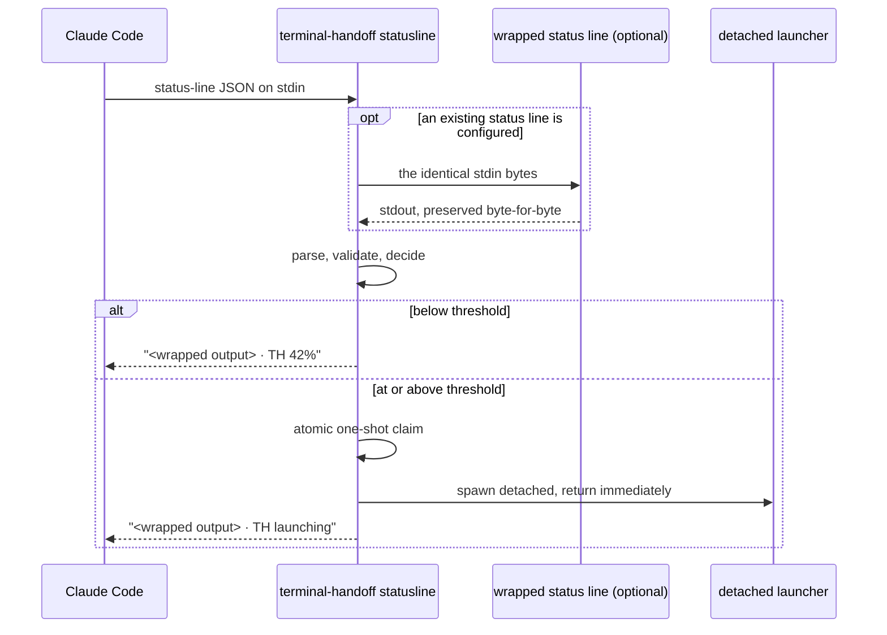
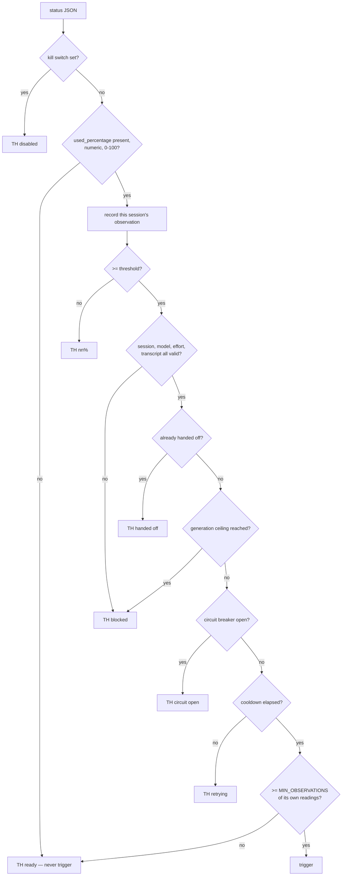
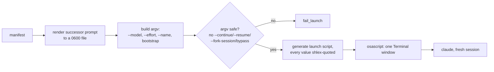
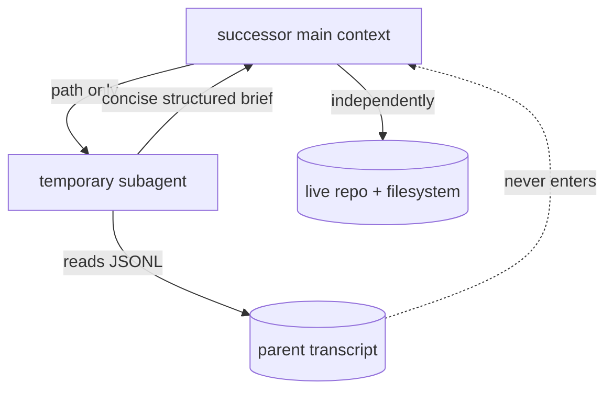
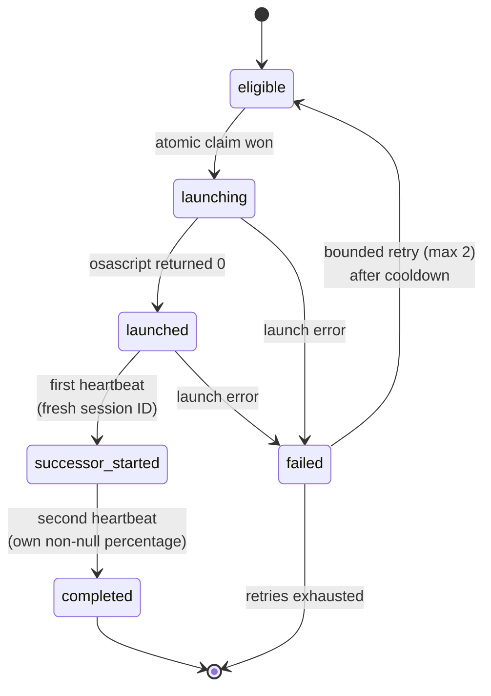
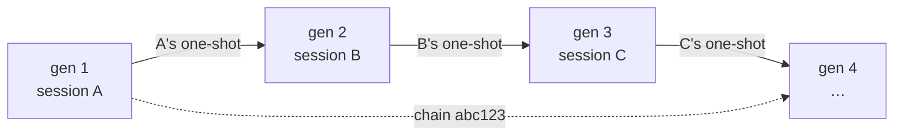

# Architecture

Terminal Handoff has one job: notice that a Claude Code session is nearly full, and hand its work to a fresh session that can verify what it inherits.

Everything below follows from two constraints:

1. **The status line runs constantly and must stay fast.** Anything slow has to happen somewhere else.
2. **Nothing may be trusted.** Not the JSON, not the transcript, not the parent's claims about its own work.

---

## 1. Status-line monitoring

Claude Code invokes the configured `statusLine` command on every status refresh and writes the official status-line JSON to its stdin. Terminal Handoff is that command.



Only these fields are read:

| Field | Use |
|---|---|
| `.context_window.used_percentage` | **the sole threshold input** |
| `.session_id` | one-shot identity, state keying |
| `.transcript_path` | validated, recorded by path, never read into context |
| `.workspace.current_dir` / `.project_dir` | successor working directory |
| `.model.id` / `.model.display_name` | exact model to preserve |
| `.effort.level` | exact effort to preserve (optional field) |
| `.session_name`, `.version`, `.workspace.git_worktree` | recorded in the manifest |

Usage is never estimated from transcript size, line count, elapsed time, message count, token guesses or session cost. `.rate_limits.five_hour.used_percentage` and `.rate_limits.seven_day.used_percentage` are **never** read: account rate limits are a different measurement from context usage, and confusing the two would fire handoffs at random.

## 2. Threshold detection

The decision runs nine gates in order. Any gate can stop it; none can be skipped.



`used_percentage` is legitimately `null` in two states — before the first API response, and after compaction. Both are non-triggering. Terminal Handoff never triggers on a missing, null, non-numeric or out-of-range value.

Gate 9 is what stops a newborn successor from firing on a stale or inherited reading: a session must have produced at least two of its *own* non-null percentage readings, keyed by its own `session_id`.

## 3. Atomic trigger claim

The status line can run concurrently. The claim is therefore a filesystem primitive, not a lock held in memory:

```python
os.open(th_path("triggered", session_id), os.O_WRONLY | os.O_CREAT | os.O_EXCL, 0o600)
```

`O_EXCL` gives exactly one winner. Every loser gets `EEXIST` and renders `TH handed off`.

The key is `session_id` — never PID, shell PID, process start time, working directory or repository name. A successor has a different session ID, so it cannot inherit its parent's claim; that single choice is what makes "one trigger per session" and "unlimited generations per chain" coexist.

## 4. Manifest creation

The detached launcher builds the manifest. It records identity, exact model, exact effort, the trigger percentage, chain and generation, applicable `CLAUDE.md` paths, and a repository snapshot: root, branch, HEAD, `origin/main`, ahead/behind, staged, modified and untracked files, recent commits, and any active merge, rebase, cherry-pick, revert or bisect.

It records **no** credentials, tokens, environment dumps, file contents, transcript contents or shell history. Files are `0600`; directories `0700`.

Git capture never happens on the status-line path — only here, in the detached process.

## 5. Terminal launch



Three quoting boundaries, each handled explicitly:

- **argv** — the model ID and effort go in as separate list elements, never as shell text.
- **the generated shell script** — every path and value passes through `shlex.quote`. Bracketed model IDs such as `claude-opus-5[1m]` are a real hazard: unquoted under zsh, `[1m]` is a glob pattern and the command fails with `no matches found`.
- **AppleScript** — backslashes and double quotes escaped; paths containing quotes or control characters are rejected before this point rather than escaped around.

The full successor instructions live in a `0600` file. Only a short bootstrap pointer is passed as an argument, so the instructions never appear in a process listing.

## 6. Fresh successor creation

The successor is an ordinary interactive session. It never uses `--continue`, `-c`, `--resume`, `-r`, `--fork-session`, `--session-id`, the parent's session ID, compaction, or transcript replay. A denylist is asserted against the constructed argv as defence in depth before anything is executed.

## 7. Transcript-analysis subagent



An 80%-full transcript would consume most of a fresh window and trigger another handoff almost immediately, so the successor's main context never receives it. The subagent returns objective, instructions, constraints, decisions, completed work, files touched, commands run, commits, tests and their exact results, approvals given and still required, blockers, the proposed next action, and — importantly — the claims that need independent verification.

## 8. Repository verification

The successor re-derives `pwd`, repository root, branch, HEAD, `origin/main`, ahead/behind, status, staged and untracked files, and any in-progress merge, rebase, cherry-pick or revert. Where the live state disagrees with the transcript, **the live state wins**. Every existing change is treated as user-owned: no reset, clean, discard, overwrite, revert, amend, force-push, delete or stash without clear authority.

## 9. Successor heartbeat

A window opening is not proof that a session started correctly — an invalid model only fails at startup, after `claude` has already been exec'd. So the parent's manifest is not closed out until the successor reports back.

The launcher exports `CLAUDE_TERMINAL_HANDOFF_MANIFEST` into the successor's environment. The successor's own status line sees it and writes back its session ID, model, effort, working directory and context percentage.



The heartbeat also refuses to treat a session as its own successor, which would otherwise be possible if a manifest path were passed to the wrong session.

## 10. Multi-generation continuation



A chain ID is generated once and inherited through environment variables; the generation number increments. Each successor's manifest points at its parent's. **One trigger per session; unlimited generations per chain.** `CLAUDE_TERMINAL_HANDOFF_MAX_GENERATIONS` imposes a ceiling if you want one; unset means unlimited, and there is no hidden stop.

## 11. Failure and retry

Every launch failure — no `claude` executable, unsafe or missing working directory, prompt render failure, unpreservable model or effort, unsafe argv, osascript failure, circuit open — routes through one function, `fail_launch()`. It records a failure state with diagnostics, never marks the handoff completed, applies the cooldown, and releases the one-shot claim for at most **2** retries before giving up and leaving the claim in place.

Notably, an unpreservable model or effort is a *failure*, not a fallback. Terminal Handoff will not open a successor with different settings.

## 12. Circuit breaker

Three launches within ten minutes trips the breaker: launching is suspended for thirty minutes, the event is logged, and the status line shows `TH circuit open`. Activation is never hidden. `reset-circuit` clears both the flag and the counting window — resetting the flag alone would let already-counted launches re-trip it immediately.

---

## Why the implementation is a single core module

The repository presents `core.py` plus six thin facade modules (`detector`, `manifest`, `launcher`, `statusline`, `security`, `state`) that re-export the public API by concern.

`core.py` is the exact implementation that was built, tested and live-verified for 1.0.0. Mechanically splitting a 2,300-line module across six files for appearance would mean rewriting import graphs and shared state handling — real risk, no behavioural gain, against code whose value is precisely that it has been proven end to end.

So the split is deliberately a **naming layer**, not a rewrite:

- `core.py` holds the implementation and stays behaviourally identical to the verified version.
- The facades give tests and callers a stable, concern-oriented API surface, and document what belongs where.
- If 1.1.0 genuinely needs the physical split, the facades are already the seams to split along, and their public names will not change.

This is recorded here rather than left implicit, because a reader who opens `detector.py` and finds only imports deserves to know it was a choice.
