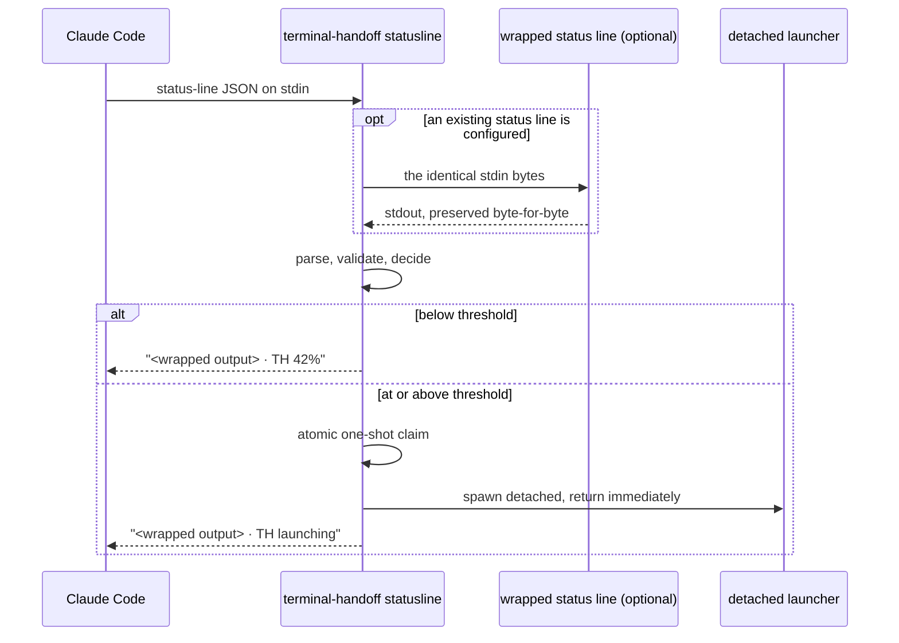
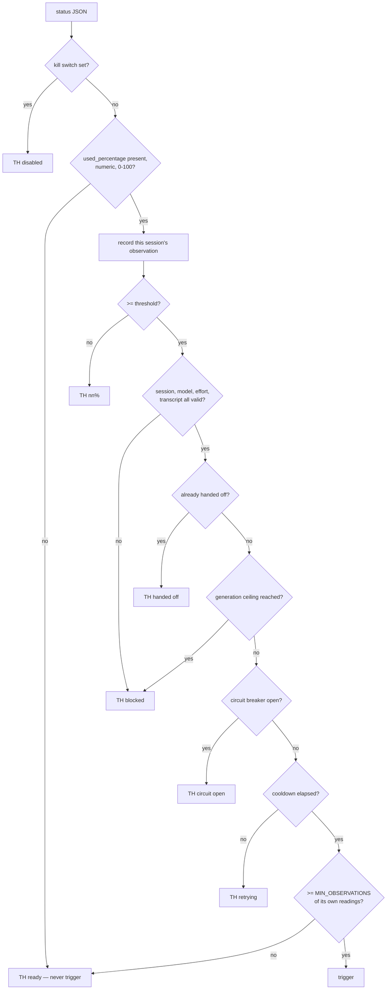
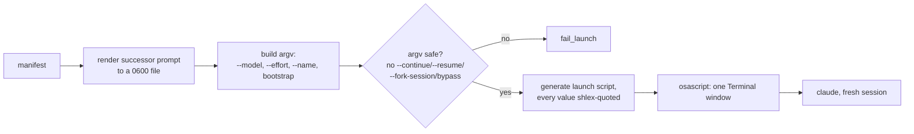
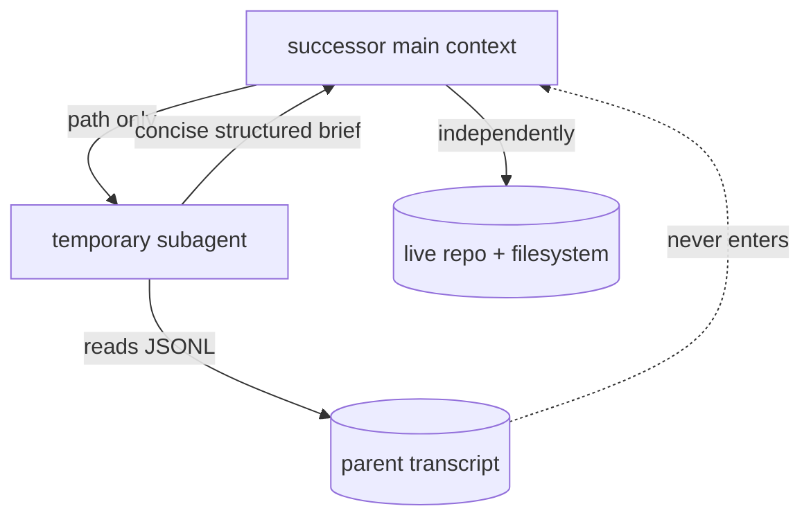
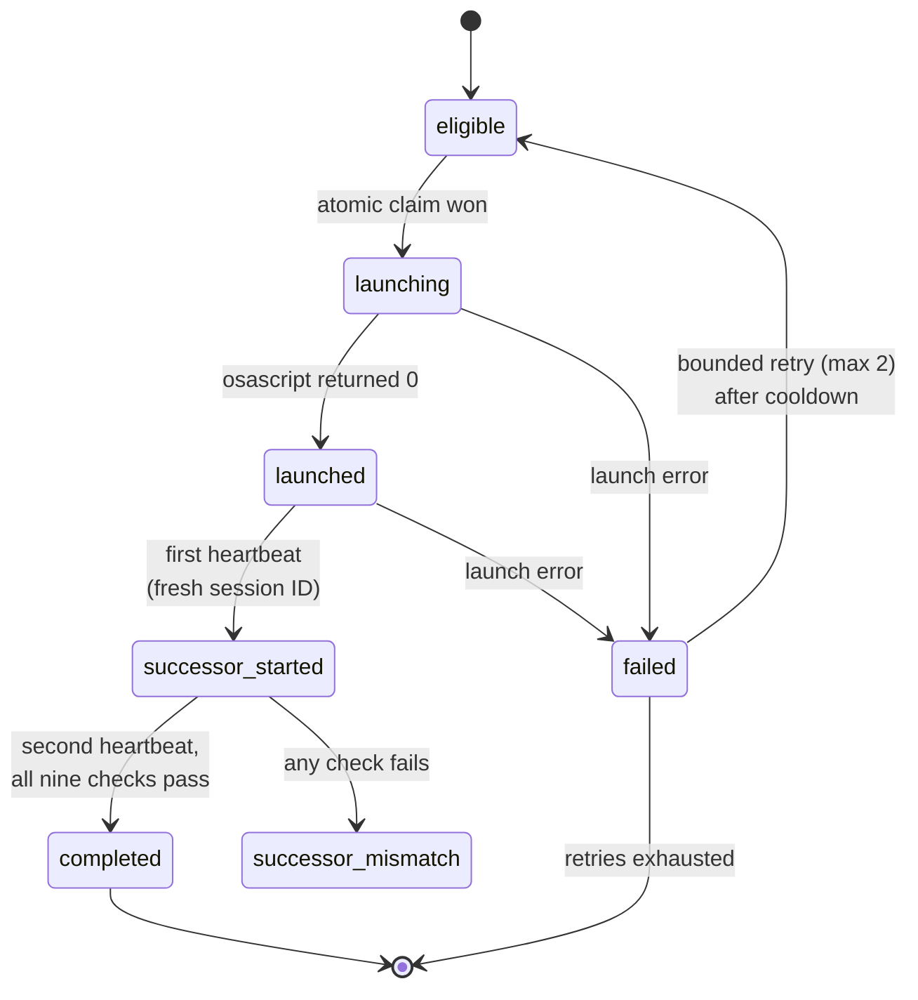
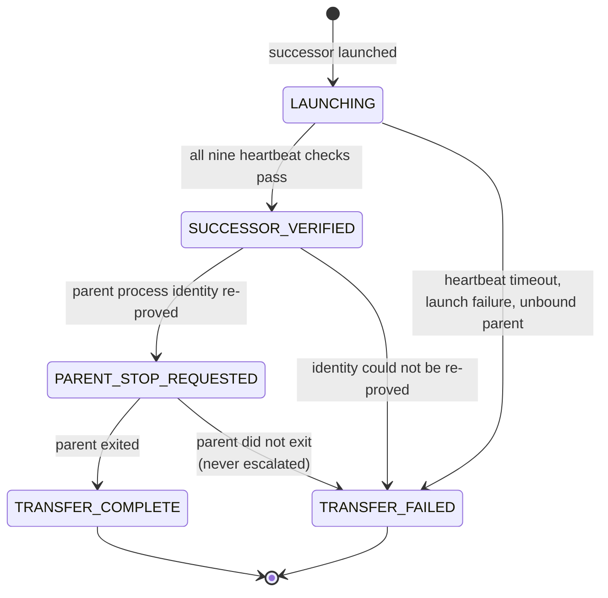
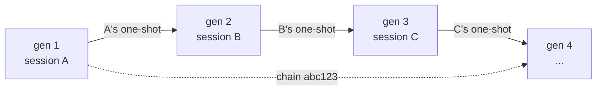
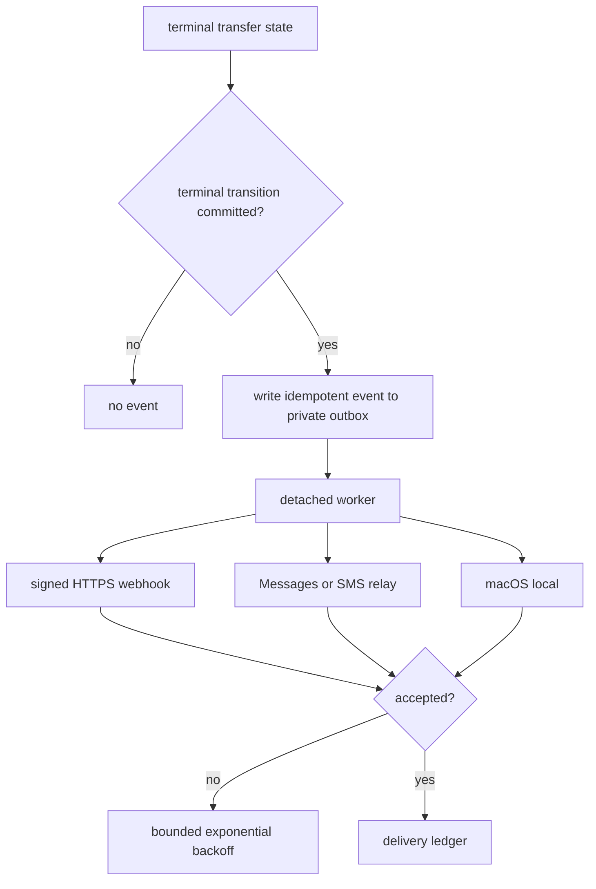

# Architecture

> Behavioural decisions with a rationale worth keeping are recorded in
> [decision 1](decisions/0001-parent-shutdown-and-successor-naming.md) and
> [decision 2](decisions/0002-exclusive-ownership-and-notification-outbox.md), and
> [decision 3](decisions/0003-manual-handoff-recovery.md).

Terminal Handoff has one job: notice that a Claude Code session is nearly full, and hand its work to a fresh session that can verify what it inherits.

Everything below follows from two constraints:

1. **The status line runs constantly and must stay fast.** Anything slow has to happen somewhere else.
2. **Nothing may be trusted.** Not the JSON, not the transcript, not the parent's claims about its own work.

---

## 1. Status-line monitoring

Claude Code invokes the configured `statusLine` command on every status refresh and writes the official status-line JSON to its stdin. Terminal Handoff is that command.



Only these fields are read:

| Field | Use |
|---|---|
| `.context_window.used_percentage` | **the sole threshold input** |
| `.session_id` | one-shot identity, state keying |
| `.transcript_path` | validated, recorded by path, never read into context |
| `.workspace.current_dir` / `.project_dir` | successor working directory |
| `.model.id` / `.model.display_name` | exact model to preserve |
| `.effort.level` | exact effort to preserve (optional field) |
| `.session_name` | **the chain's base display name**, captured once at generation 1 |
| `.version`, `.workspace.git_worktree` | recorded in the manifest |

Usage is never estimated from transcript size, line count, elapsed time, message count, token guesses or session cost. `.rate_limits.five_hour.used_percentage` and `.rate_limits.seven_day.used_percentage` are **never** read: account rate limits are a different measurement from context usage, and confusing the two would fire handoffs at random.

## 2. Threshold detection

The decision runs nine gates in order. Any gate can stop it; none can be skipped.



`used_percentage` is legitimately `null` in two states — before the first API response, and after compaction. Both are non-triggering. Terminal Handoff never triggers on a missing, null, non-numeric or out-of-range value.

Gate 9 is what stops a newborn successor from firing on a stale or inherited reading: a session must have produced at least two of its *own* non-null percentage readings, keyed by its own `session_id`.

## 3. Atomic trigger claim

The status line can run concurrently. The claim is therefore a filesystem primitive, not a lock held in memory:

```python
os.open(th_path("triggered", session_id), os.O_WRONLY | os.O_CREAT | os.O_EXCL, 0o600)
```

`O_EXCL` gives exactly one winner. Every loser gets `EEXIST` and renders `TH handed off`.

The key is `session_id` — never PID, shell PID, process start time, working directory or repository name. A successor has a different session ID, so it cannot inherit its parent's claim; that single choice is what makes "one trigger per session" and "unlimited generations per chain" coexist.

## 3a. Manual `/handoff` recovery

Every valid status refresh writes a private, minimal snapshot under
`sessions/<session-id>.json`. It contains only the verified launch facts and no
unknown status fields, transcript contents or environment dump. Claude Code's
personal `/handoff` skill supplies `${CLAUDE_SESSION_ID}` directly to the
runtime, so recovery never selects a session by terminal order, directory name
or model judgement.

The manual path requires a snapshot no older than 30 seconds and binds the
exact current Claude ancestor before claiming a launch. It takes the same
per-session trigger lock as the automatic path. Active and completed transfers
are refused. A `TRANSFER_FAILED` attempt is written to
`recoveries/<session-id>/` before its claim is replaced. From that point the
normal manifest, launcher, heartbeat, ownership and notification paths are
reused. Manual recovery bypasses only the context threshold and observation
count; it does not bypass process binding, generation ceiling, storm breaker,
argv validation, successor verification or ownership transfer.

A trigger claim with no transfer or launch record can be a launcher crash. It
is not replaced inside the normal launcher race window. After 90 seconds, with
no completed launch record, `/handoff` treats it as an orphan, archives it and
claims one recovery attempt. The lower bound is always 60 seconds.

## 4. Manifest creation

The detached launcher builds the manifest. It records identity, exact model, exact effort, the trigger percentage, chain and generation, applicable `CLAUDE.md` paths, and a repository snapshot: root, branch, HEAD, `origin/main`, ahead/behind, staged, modified and untracked files, recent commits, and any active merge, rebase, cherry-pick, revert or bisect.

It records **no** credentials, tokens, environment dumps, file contents, transcript contents or shell history. Files are `0600`; directories `0700`.

Git capture never happens on the status-line path — only here, in the detached process.

## 5. Terminal launch



Three quoting boundaries, each handled explicitly:

- **argv** — the model ID and effort go in as separate list elements, never as shell text.
- **the generated shell script** — every path and value passes through `shlex.quote`. Bracketed model IDs such as `claude-opus-5[1m]` are a real hazard: unquoted under zsh, `[1m]` is a glob pattern and the command fails with `no matches found`.
- **AppleScript** — backslashes and double quotes escaped; paths containing quotes or control characters are rejected before this point rather than escaped around.

The full successor instructions live in a `0600` file. Only a short bootstrap pointer is passed as an argument, so the instructions never appear in a process listing.

## 6. Fresh successor creation

The successor is an ordinary interactive session. It never uses `--continue`, `-c`, `--resume`, `-r`, `--fork-session`, `--session-id`, the parent's session ID, compaction, or transcript replay. A denylist is asserted against the constructed argv as defence in depth before anything is executed.

## 7. Transcript-analysis subagent



An 80%-full transcript would consume most of a fresh window and trigger another handoff almost immediately, so the successor's main context never receives it. The subagent returns objective, instructions, constraints, decisions, completed work, files touched, commands run, commits, tests and their exact results, approvals given and still required, blockers, the proposed next action, and — importantly — the claims that need independent verification.

## 8. Repository verification

The successor re-derives `pwd`, repository root, branch, HEAD, `origin/main`, ahead/behind, status, staged and untracked files, and any in-progress merge, rebase, cherry-pick or revert. Where the live state disagrees with the transcript, **the live state wins**. Every existing change is treated as user-owned: no reset, clean, discard, overwrite, revert, amend, force-push, delete or stash without clear authority.

## 9. Successor heartbeat — the transfer gate

A window opening is not proof that a session started correctly — an invalid model only fails at startup, after `claude` has already been exec'd. So the parent's manifest is not closed out, and the parent is not stopped, until the successor reports back.

The launcher exports `CLAUDE_TERMINAL_HANDOFF_MANIFEST`, `..._CHAIN_ID`, `..._GENERATION`, `..._BASE_NAME` and `..._TRANSFER` into the successor's Terminal window. The successor's own status line sees them and writes back its session ID, model, effort, working directory, chain, generation and live context percentage.

Nine checks must all pass, across two heartbeats:

| Check | Proves |
|---|---|
| `session_id_present` | there is a session at all |
| `session_id_is_fresh` | it is not the parent |
| `session_id_unused` | it is not a session already recorded elsewhere in this chain |
| `model_matches` | the exact model was preserved |
| `effort_matches` | the exact effort — including "none" — was preserved |
| `cwd_matches` | it started in the right directory |
| `chain_matches` | it belongs to this chain |
| `generation_matches` | it is the generation that was launched |
| `context_percentage_live` | it is running, not merely spawned |

Any failure records `successor_mismatch` in the manifest, `successor_rejected` in the transfer, and leaves the parent alone.



The heartbeat also refuses to treat a session as its own successor, which would otherwise be possible if a manifest path were passed to the wrong session.

## 9a. Successor naming

The chain carries a **base display name** and a **chain ID**, and they are different things.

- The base display name is human-facing: `Ranger`. It is captured once, from `.session_name`, when the chain is created, written to `chains/<chain-id>.json`, and never rewritten. Generation *n* is displayed as `<base> <n>`; generation 1 keeps the base name unchanged.
- The chain ID is machine-safe hex used to key state. It never appears as a session name.

The generation number is read from trusted chain state — `chains/<chain-id>.json` records which session ID occupies which generation. When a Claude Code tool subprocess does not retain the launcher's custom environment, Terminal Handoff searches its private chain records for that exact session ID and restores the chain and generation only when there is exactly one match. It falls back to the launcher's exported `CLAUDE_TERMINAL_HANDOFF_GENERATION` when chain state does not yet know the session. It is never derived by parsing digits off a visible name, so `Project 42` hands off to `Project 42 2`.

Version 1.2.3 also recognises the exact split-chain shape produced by the
v1.2.1 manual bug. A generation-2 session is mapped back only when a completed
manual transfer proves its parent and verified successor IDs, the parent occurs
in exactly one other trusted chain, and the stored display names agree. The
mapping restores the original chain and increments its generation; it never
parses the visible suffix.

If no session name is available, the documented fallback is `Terminal Handoff <chain-id[:8]>`. No repository, directory or project name is ever substituted.

## 9b. Transfer of ownership and parent shutdown

Two agents in one repository is the failure this prevents. There is exactly one boundary.



`LAUNCHING` and `SUCCESSOR_VERIFIED` mean the **parent** owns continuation.
`PARENT_STOP_REQUESTED` has owner `none`: shutdown was requested but the parent
may still be alive, so neither session may mutate. Only `TRANSFER_COMPLETE`
gives the **successor** ownership. `TRANSFER_FAILED` gives ownership back to the
parent, which is still running.

Transitions happen under an exclusive lock, are refused when illegal, and
append to a history carrying the reason and requesting PID. Repeating a
transition is refused. A supervisor additionally holds a non-blocking `flock`
lease for its process lifetime. The kernel releases it after a clean exit or a
crash. Parent and successor status refreshes probe the lease and respawn a
missing supervisor, while concurrent replacements lose the same lease and exit
without signalling.

**Binding the parent.** The Claude process is bound inside the status-line process at trigger time, because the detached launcher starts its own session and has no ancestry to trace. `ps` walks upward to the nearest process whose executable file is named exactly `claude`; the candidate must be within six levels, owned by the same UID, not this process, and working in the same directory as the session in the payload. PID, start time, TTY, UID, executable name, working directory, session, chain and generation are all recorded.

**Stopping it.** A detached supervisor waits for `SUCCESSOR_VERIFIED`, re-proves every recorded value with no wait between the check and the signal, then sends one `SIGTERM` — at most twice, never `SIGKILL`, never to a process group, never by name. The parent's shell and Terminal window are untouched, so the window stays open at a prompt.

**Restart is deterministic.** Running the supervisor again from any state does
the same thing: it resumes waiting from `LAUNCHING`, stops from
`SUCCESSOR_VERIFIED`, observes without re-signalling from
`PARENT_STOP_REQUESTED`, and exits without signalling from `TRANSFER_COMPLETE`
or `TRANSFER_FAILED`. From an interrupted stop request it completes if the
exact parent is gone, or fails back to the still-live parent after the original
grace budget. A later status refresh performs that restart automatically after
a crash.

## 10. Multi-generation continuation



A chain ID and a base display name are generated once and inherited through environment variables and `chains/<chain-id>.json`; the generation number increments, and so does the visible name — `Ranger`, `Ranger 2`, `Ranger 3`. Each successor's manifest points at its parent's. **One trigger per session; unlimited generations per chain.** `CLAUDE_TERMINAL_HANDOFF_MAX_GENERATIONS` imposes a ceiling if you want one; unset means unlimited, and there is no hidden stop.

## 11. Failure and retry

Every launch failure — no `claude` executable, unsafe or missing working directory, prompt render failure, unpreservable model or effort, unsafe argv, osascript failure, circuit open — routes through one function, `fail_launch()`. It records a failure state with diagnostics, never marks the handoff completed, applies the cooldown, and releases the one-shot claim for at most **2** retries before giving up and leaving the claim in place.

Notably, an unpreservable model or effort is a *failure*, not a fallback. Terminal Handoff will not open a successor with different settings.

## 12. Circuit breaker

Three launches within ten minutes trips the breaker: launching is suspended for thirty minutes, the event is logged, and the status line shows `TH circuit open`. Activation is never hidden. `reset-circuit` clears both the flag and the counting window — resetting the flag alone would let already-counted launches re-trip it immediately.

## 13. Durable notification outbox

Notifications follow a transactional-outbox boundary:



The transfer write is authoritative and always happens first. Enqueue or
delivery failure cannot roll it back. Every later status refresh reconciles
terminal 1.2 records against the outbox, repairing a crash in the narrow gap
between state commit and event creation without alerting on pre-1.2 history.
Events are keyed deterministically by the parent session and terminal state, so
repeated code paths create one outbox record. Webhooks carry the same ID as
`Idempotency-Key` and an HMAC-SHA256 over timestamp plus canonical JSON.

The ledger is per channel. If local delivery succeeds and the webhook fails,
only the webhook is retried. Exhausted events move to `outbox/dead` and can be
explicitly retried. This provides at-least-once delivery with deduplication,
not a false exactly-once claim.

Outbound events contain human display names, generations, ownership, urgency,
presence and the concise message. They contain no transcript contents or
paths, prompt, repository path, environment dump, credential or secret.

---

## Why the implementation is a single core module

The repository presents `core.py` plus nine thin facade modules (`detector`,
`manifest`, `launcher`, `naming`, `notifications`, `statusline`, `security`,
`state`, `transfer`) that re-export the public API by concern.

`core.py` preserves the single-file installed runtime that was built,
live-verified for 1.0.0 and hardened in place since. Mechanically splitting a
large runtime across many installed files for appearance would rewrite import
graphs and shared state handling, adding real deployment risk without a
behavioural gain.

So the split is deliberately a **naming layer**, not a rewrite:

- `core.py` holds the implementation and stays behaviourally identical to the verified version.
- The facades give tests and callers a stable, concern-oriented API surface, and document what belongs where.
- If a later release genuinely needs the physical split, the facades are already the seams to split along, and their public names will not change.

This is recorded here rather than left implicit, because a reader who opens `detector.py` and finds only imports deserves to know it was a choice.
