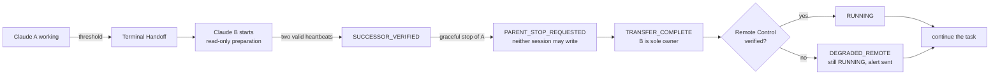
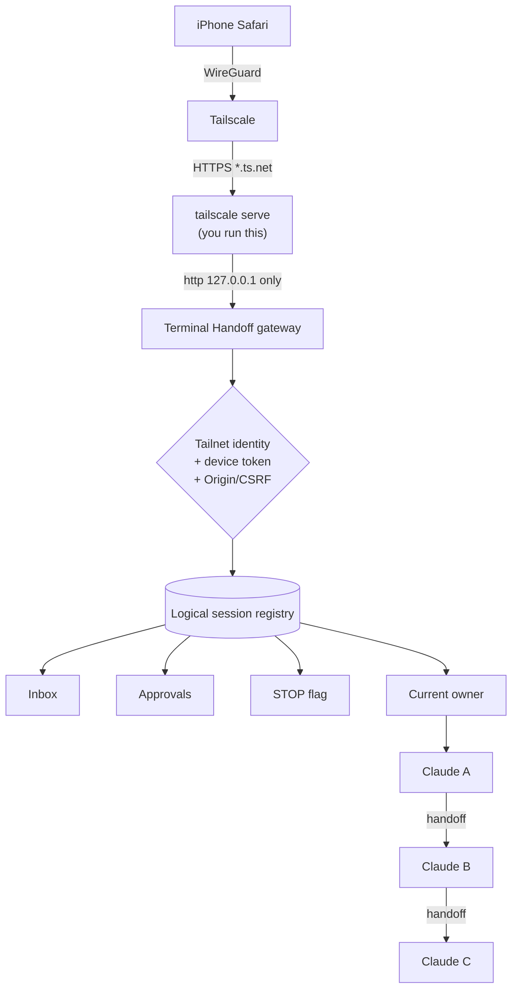
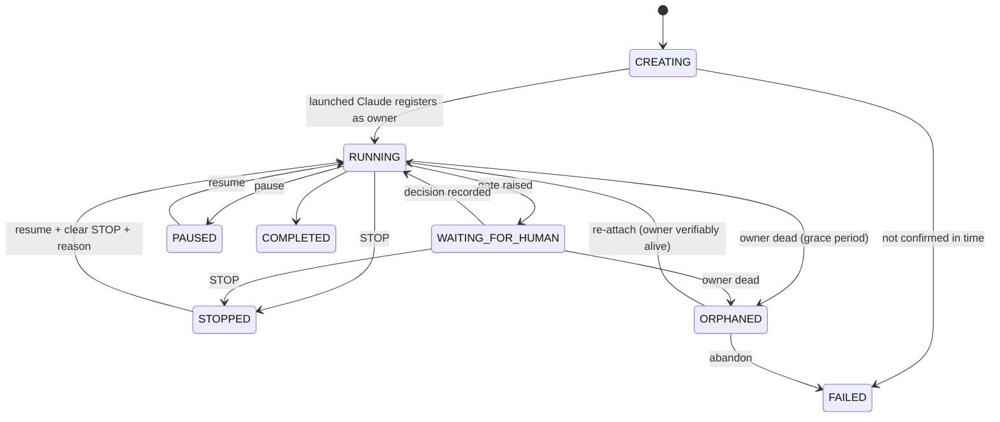
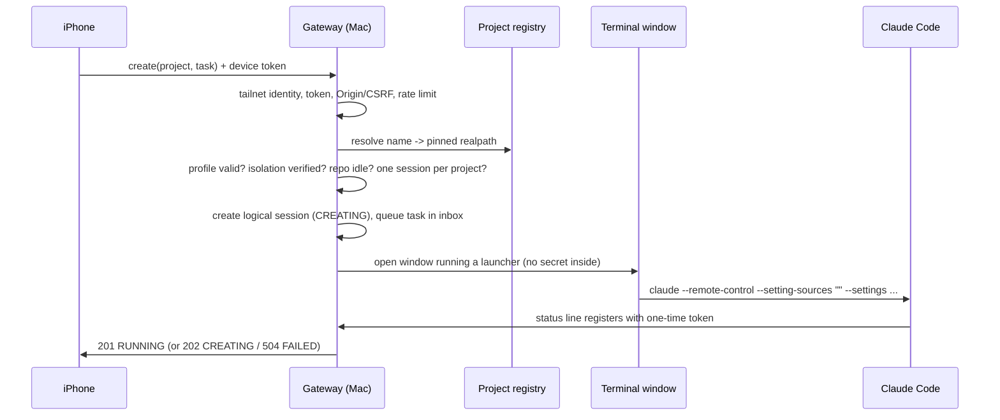

# Remote session control

Terminal Handoff can hand a session over to a successor **and** be steered from
an authorised phone while your Mac does the work. This document is the complete
description: architecture, threat model, set-up, behaviour and limits.

> **Status.** Everything here is implemented and tested locally. It has not yet
> been exposed on a real tailnet or used from a real phone. Nothing starts a
> network service unless you run `remote serve`, and nothing is published to
> Tailscale unless you run `tailscale serve` yourself.

## Contents

1. [What it is, and what it is not](#what-it-is-and-what-it-is-not)
2. [Automatic continuation](#automatic-continuation)
3. [Architecture](#architecture)
4. [Logical sessions](#logical-sessions)
5. [Human gates and approvals](#human-gates-and-approvals)
6. [Terminal Handoff gates versus Claude permission prompts](#terminal-handoff-gates-versus-claude-permission-prompts)
7. [Instructions, the inbox and waking Claude](#instructions-the-inbox-and-waking-claude)
8. [STOP and pause](#stop-and-pause)
9. [Project registry](#project-registry)
10. [Permission profiles and isolation](#permission-profiles-and-isolation)
11. [Starting a session from the phone](#starting-a-session-from-the-phone)
12. [Dead-owner detection and recovery](#dead-owner-detection-and-recovery)
13. [Degraded remote control](#degraded-remote-control)
14. [Network and authentication](#network-and-authentication)
15. [Threat model](#threat-model)
16. [Persistent security state](#persistent-security-state)
17. [Set-up, enrolment and rollback](#set-up-enrolment-and-rollback)
18. [Limitations](#limitations)
19. [Troubleshooting](#troubleshooting)

## What it is, and what it is not

The phone controls **Terminal Handoff and registered agent sessions**. Claude
Code always runs on the Mac, inside a repository the Mac's own registry names,
under the Mac's own Claude login. The phone never receives a shell, a terminal,
a path, a PID or a Claude credential. There is no endpoint that accepts a
command.

## Automatic continuation

A successful handoff means *continue the existing task*. After ownership has
transferred, the successor verifies Remote Control, then resumes the unfinished,
already-authorised work without asking permission to continue.



Continuation is **never automatic approval**. The successor stops only at a
genuine human boundary (see [Human gates](#human-gates-and-approvals)). The
existing single-owner protections are unchanged: only `TRANSFER_COMPLETE` gives
the successor ownership, the parent is stopped with one graceful signal to a
re-proved process, and duplicate or forged transfers are refused.

Successor phases are recorded on the transfer record:
`PREPARING_SUCCESSOR`, `SUCCESSOR_READY`, `OWNERSHIP_TRANSFERRING`,
`SUCCESSOR_OWNER`, `REMOTE_CONTROL_VERIFYING`, `RUNNING`, `WAITING_FOR_HUMAN`,
`DEGRADED_REMOTE`, `FAILED`.

## Architecture



The **logical session** is the durable control object. Claude processes are
disposable workers beneath it. The phone addresses a `logical_session_id`;
Terminal Handoff decides who the current legitimate owner is. The phone never
addresses a PID.

## Logical sessions

Each is a private JSON file `~/.claude/terminal-handoff/logical/ls_<24 hex>.json`
holding: project, branch, state, the owner (Claude session, generation, fencing
`epoch`, verified process binding), the STOP and pause flags, the instruction
inbox, approvals, Remote Control health, recent output and history.

**Ownership is fenced.** Every ownership change increments `owner_epoch`.
Ownership moves only when a `TRANSFER_COMPLETE` transfer names the registered
owner as its parent. Inbox reads, acknowledgements, approval consumption and
output can be performed only by the current owner at the current epoch, so a
stale owner is refused everywhere.



`REMOTE DISCONNECTED` is not a state: the phone being offline changes nothing
about the session. Remote Control health is a separate field
(`healthy`, `degraded`, `disabled`, `unknown`). `HANDOFF FAILED` is a transfer
state (`TRANSFER_FAILED`), in which the parent keeps the work.

## Human gates and approvals

The agent stops before an action that needs a human and asks:

```
session gate --reason "<why>" --requested-action "<the exact action>"
```

The state becomes `WAITING_FOR_HUMAN`, one notification is sent (never repeated
for the same open request) and the phone shows:

```
APPROVAL REQUIRED
Project: Nova
Requested action:  Restart the Nova production service after deploying commit abc123.
Reason:            The updated service cannot take effect until restarted.
[ DENY ]   [ APPROVE ]
```

An approval is bound to the **logical session**, the **approval id**, the
**exact action**, the **owner epoch**, a **nonce** and an **expiry** (default 6
hours, `CLAUDE_TERMINAL_HANDOFF_APPROVAL_TTL`).

| Situation | Result |
|---|---|
| Decision with the wrong nonce, id or session | refused |
| Decision made against an older owner epoch | refused as **stale**; the phone reloads and shows the same action again |
| Second approve/deny for the same request | refused (`not pending`); the first decision stands |
| Approved, then `consume` twice | second consume refused: an approval runs **once** |
| Consumed with different wording of the action | refused: *request a new approval* (whitespace-only differences are not a change) |
| Agent asks for a different action while one is open | the old request is superseded; only the new one can be approved |
| Expired | cannot be decided or consumed |
| Pending during a handoff | survives, re-bound to the new epoch; must be re-viewed before it can be decided |
| **Approved but unused** during a handoff | **invalidated**: the successor must ask again |
| STOP active | cannot be consumed |
| Session ORPHANED / ended | no decisions accepted |

The agent cannot resume its own gate: `continuation resume` is refused while a
linked approval is undecided.

## Terminal Handoff gates versus Claude permission prompts

These are two different things.

* A **Terminal Handoff human gate** is an authority boundary the agent
  *chooses to stop at*. The phone can answer it, remotely, with the semantics
  above.
* A **Claude native permission prompt** is Claude Code's own tool-permission
  dialog. There is **no supported interface** to answer it from outside, and
  Terminal Handoff does not pretend otherwise: it never types into a terminal,
  never uses AppleScript to send keys, never writes to a PTY and never speaks
  Claude's internal socket protocol.

A Terminal Handoff approval therefore does **not** answer a native prompt. If a
remote session reaches a native prompt for something outside its allowed tools,
it waits for you to answer it in the terminal or through Claude's own Remote
Control (where Claude supports that). This is why permission profiles exist:
routine work is pre-allowed so an unattended session rarely meets a prompt.

## Instructions, the inbox and waking Claude

An instruction from the phone is appended to the logical session's **durable
inbox**: ordered (`seq`), timestamped, uniquely identified, deduplicated by
request id, and audit logged. The inbox is the only source of truth.

* Delivery is to the **current owner only**, at the current epoch.
* Delivered-but-unacknowledged instructions are offered again after a lease
  (10 minutes) and are returned to the queue if ownership changes.
* Instructions sent during a handoff, while Claude is busy, while STOPPED, or
  while the phone is offline are never lost.

### Waking

Claude Code has **no supported interface** for an external process to message
an idle interactive session. The peer socket in `~/.claude/sessions/*.json` is
undocumented for external use, and keystroke injection is refused. So the
agent stays reachable by *blocking* in a supported way:

```
session wait --timeout 540      # a Bash tool call, at most ~10 minutes
```

It returns the moment work arrives for the current owner: instructions, an
approval decision, or STOP/resume. While blocked it costs no model tokens. It
polls a local file every 1 s when the session was recently active, every 3 s
when idle, and every 5 s when halted, and is bounded (590 s), after which the
agent simply calls it again. A stale owner's `wait` returns `STOP`.

A `Stop` hook (documented Claude Code contract: exit code 2 keeps Claude
working) stops the agent from ending its turn while work is waiting. The UI
shows whether Claude has checked in recently ("Claude is listening" versus
"busy or away; it will see new instructions at its next check").

If the agent is not in a `wait` loop (busy in a long tool call, or its turn
ended without one) the instruction stays pending and is picked up at its next
check. **Delivery is guaranteed; latency is not.**

## STOP and pause

`STOP` belongs to the **logical session**, not a PID.

* **Cooperative:** inbox delivery, gate requests, approval consumption and
  `wait` all refuse or return `HALT`. The agent is told to do no further
  autonomous mutation and never to clear STOP.
* **Persistent:** it survives handoffs to successors, Terminal Handoff
  restarts and owner death. A handoff never clears it.
* **Hard backstop (optional):** `--hard` sends one graceful `SIGTERM`, only
  after re-proving the recorded process binding (same start time, same
  executable, same user). It never sends `SIGKILL`, never takes a PID from a
  caller, and does nothing if the binding cannot be proved. It reuses the
  existing single signalling call.
* **Deliberate resume:** clearing STOP needs `clear_stop` **and** a reason. A
  plain resume is refused. Pause is separate and cannot downgrade a STOP.

The cooperative layer depends on the agent obeying; the hard backstop covers a
misbehaving one when a process binding exists.

## Project registry

The phone sends a **name**. The Mac resolves it.

```
terminal-handoff project add nova "$HOME/Nova"
terminal-handoff project list
```

Names must match `^[a-z0-9][a-z0-9-]{0,39}$`. A registered entry keeps the path
as supplied and a **pinned realpath**; at launch the path must still resolve
to that realpath, so a swapped symlink is refused. `/`, your home directory and
Terminal Handoff's own directory cannot be registered. The API rejects any
request field other than `project`, `task` and `request_id`.

## Permission profiles and isolation

A remote project must have an explicit permission profile. There is no default
and no fallback: **no valid profile means no unattended launch.**

```
terminal-handoff project permissions template nova     # a starting point, never applied
terminal-handoff project permissions edit nova         # opens $EDITOR, validates on save
terminal-handoff project permissions validate nova
terminal-handoff project enable-remote nova            # deliberate, and only if valid
```

```json
{
  "profile": "development",
  "allow": ["Read", "Grep", "Glob", "Bash(git status:*)", "Bash(git diff:*)"],
  "deny": [],
  "human_gate": ["production deployment", "production restart", "rollback",
                 "destructive filesystem operation", "credential changes",
                 "security configuration changes", "irreversible external action"]
}
```

Use `Edit(<path>)` for file changes: Claude reports that `Write(...)` allow rules are
not matched and only `Edit(path)` rules are (they cover all file-editing tools), so
validation rejects `Write`, `MultiEdit` and `NotebookEdit` rules.

Validation rejects: unknown keys (so no `defaultMode`, permission mode or
bypass can be set); bare `Bash`, `Bash(*)` and unrestricted `Edit`/`Write`;
pre-approval of `rm`, `sudo`, `git push`, `curl`, `kubectl`, `docker`, deploy
CLIs and similar; and any profile that drops a mandatory human gate. A hash of
the validated profile is stored; changing it disables remote launch until you
re-enable it, and tampering fails closed.

### Why `--settings` alone is not a boundary

`--settings <file>` **adds** to your user, project and local settings; lists such
as `permissions.allow` are combined. Broader rules you already have would stay
effective. So a remote session is launched with

```
--setting-sources "" --settings <per-session file>
```

so that **only** the profile applies (managed/organisation settings cannot be
excluded and still apply). Because your other settings are then not loaded, the
per-session file also carries the Terminal Handoff status line and the `Stop`
hook, and sets `permissions.disableBypassPermissionsMode` and
`disableAutoMode` to `"disable"`. Your own settings files are never edited.
Successor sessions in the chain inherit the same file.

`--setting-sources` appears in `claude --help` but not in the published
documentation, so it is **verified on your machine** rather than assumed:

```
terminal-handoff remote verify-isolation
```

runs two small `claude -p` probes in a throwaway directory (a project allow rule
must be *blocked*, and the profile file alone must be able to *grant*), and
records the result **per Claude version**. Until it passes for the installed
version, remote launch returns `isolation_unverified` (fail closed). A Claude
upgrade requires re-verification.

Trade-off: a remote session does not load the repository's own
`.claude/settings*.json` (including any project hooks). `CLAUDE.md` files still
load.

## Folder trust (one-time human step per project)

Claude Code asks *"Is this a project you created or one you trust?"* the first
time it opens a folder. An unattended launch cannot answer that, and Terminal
Handoff never answers it for you (no keystroke injection, no editing of Claude's
own configuration). Before a project can be launched remotely, open Claude in that
folder **once** yourself and choose *Yes, I trust this folder*. Until then a remote
create is reported as `FAILED` ("the Mac did not confirm the session started")
and the Terminal window shows the trust question.

## Starting a session from the phone



Success (`201 RUNNING`) is returned only after the launched Claude has
registered as owner. The task text goes into the inbox and is read by the agent
as data; it never reaches a shell or argv. Only one active session per project
is allowed (a single writer).

## Dead-owner detection and recovery

A session must not keep showing `RUNNING` after its owner died. Every 15 s the
gateway re-checks each active session's owner using independent signals:

* the recorded process binding, re-proved;
* Claude's own live session record for that session ID;
* a status-line snapshot within the last 30 s.

Any positive signal means *alive*. It is *dead* only when the binding proves the
process is gone or reused **and** nothing else shows the session alive. *Unknown*
is never treated as death. Death must persist for 3 checks over 60 s
(`CLAUDE_TERMINAL_HANDOFF_OWNER_GRACE`) before the state becomes `ORPHANED`,
which sends one alert. A parent that a completing handoff is *meant* to stop is
not orphaned.

`ORPHANED` is never repaired automatically and **no replacement agent is
launched**. You choose: **Re-check** (re-attach, only if the owner is now
verifiably alive) or **Abandon** (`FAILED`). STOP, the inbox and pending
approvals are preserved throughout. Relaunching a replacement agent is not
implemented.

### Terminal Handoff restart

`remote serve` runs recovery at start: it reloads every logical session,
revalidates the project registration, expires stale approvals, and checks each
owner twice. A session whose owner is **not verifiably alive** becomes
`ORPHANED`, not `RUNNING`. `terminal-handoff session reconcile --startup` does
the same on demand. **A Mac reboot is not recovered**: Claude processes do not
survive it, so those sessions are simply orphaned.

## Degraded remote control

Remote Control health comes from Claude's own live session record (a registered
bridge). It is checked at launch, by the agent's `session check`, and again for
every new owner after a handoff. If it fails the state is `degraded`, one alert
is sent with the reason, and the session **keeps running**: a healthy successor is
never killed for a channel fault. While degraded, a gate notification tells you
to return to the terminal instead. `CLAUDE_TERMINAL_HANDOFF_REMOTE_CONTROL=0`
disables the `--remote-control` flag and reports the state as `disabled`.

## Network and authentication

**Tailscale only.** Never use Tailscale Funnel, and never publish the port
another way. The gateway:

* binds `127.0.0.1` only and refuses to start otherwise;
* refuses to start unless `tailscale status --json` shows Tailscale running and
  this Mac's name equal to the configured `allowed_host`;
* refuses every request whose `Host` is not that name, with the configured
  `public_port` if one is given (DNS-rebinding defence), and requires the `Origin`
  of a change to be exactly `https://<host>[:<public_port>]`;
* refuses to start on a local port that an existing `tailscale serve` mapping
  already proxies to (read-only check), so it is never exposed by accident;
* requires a `Tailscale-User-Login` (set by `tailscale serve`) on an allowlist.

**Device tokens** (second layer): 256-bit, generated on the Mac, stored only as a
SHA-256 hash, revocable, expiring (14 days by default, 90 maximum) and shown once
through a single-use enrolment code valid for 10 minutes. Browsers keep the token
in a `__Host-` cookie (`Secure; HttpOnly; SameSite=Strict`); scripts never see
it. Cookie-authenticated changes need a per-device CSRF token **and** an exact
`Origin`; bodies must be `application/json`. Every request re-reads the device
file, so revocation and expiry take effect immediately, including on an open
browser session.

CLI: `remote configure`, `remote enroll-device`, `remote list-devices`
(name, created, expiry, revoked, last used), `remote revoke-device`,
`remote check`, `remote serve`, `remote verify-isolation`.

The interface is served with `Content-Security-Policy: default-src 'none';
script-src 'self'; style-src 'self'; ...`, no inline script, and every piece of
dynamic text is set with `textContent`.

## Threat model

| Threat | Mitigation |
|---|---|
| Internet exposure | loopback bind; Tailscale-only publication; startup fails closed; Funnel forbidden |
| Stolen or lost phone | per-device revocation, 14-day expiry, no shell surface, STOP available from any other device |
| Token theft from the Mac | only hashes stored; tokens never logged or returned in bodies |
| Cross-site request | `Origin` check, CSRF token for cookies, JSON-only bodies, `SameSite=Strict` |
| DNS rebinding / local web page | `Host` allowlist; header identity only trusted on loopback |
| Path traversal / symlink swap | names only; regex; pinned realpath re-checked at launch |
| Command / prompt injection through task text | data in inbox; never shell or argv; agent told instructions never approve gates |
| Arbitrary shell or PID control | no such endpoint exists; body fields are whitelisted; handler contains no process or shell call |
| Replay | request ids (durable dedupe for instructions, creation and approvals); approval nonce, epoch, one-shot consume |
| Stale owner / split brain | fenced owner epoch; single `TRANSFER_COMPLETE` ownership gate; one session per project |
| Permission escalation | validated profiles; `--setting-sources ""`; no bypass flags; isolation verified per Claude version |
| Brute force | persistent lockout after 8 failures / 5 min; enrolment 5 / 10 min |
| Secret leakage | redaction of stored output; secrets never logged; launch token never on argv or in the script |
| Approval confusion | UI shows the exact action; wording change requires a new approval; native prompts are not answered |

**Security assumptions.** The Mac and your user account are trusted. A local
process running as you could forge the tailnet header, but still needs a device
token; it could also read your files, which is outside this design's scope. The
Tailscale control plane and your tailnet's ACLs are trusted. **Set Tailscale ACLs
so only your own devices can reach this Mac.**

## Persistent security state

Restarting the gateway must not reset a lockout or an attempt budget. A small
private file (`remote/security_state.json`, mode 0600, atomic and locked) keeps
authentication-failure lockouts, enrolment attempts and the limits on approvals,
session creation, STOP/pause/resume and recovery. It holds only timestamps and
keys made of the tailnet login and peer address, never a secret. General request
rate limiting stays in memory: losing it on restart only loosens throttling of
harmless reads. Replays are safe across restarts without a cache, because
instruction dedupe, creation dedupe and approval status are durable.

**Launch tokens.** The one-time launch token is stored server-side only as a
hash, expires in 5 minutes and is single use. The launcher script contains no
secret: it reads the token from a mode-0600 file and deletes both that file and
itself before Claude starts (the server removes leftovers after registration or
failure and sweeps stale files). The token must still reach the Claude process
so its status line can register; passing it on argv would expose it to `ps`, and
an environment variable is visible only to the same user. It is useless after
first use.

## Set-up, enrolment and rollback

Nothing below has been run against your live tailnet yet.

```sh
# 1. Register a project and its permission profile
terminal-handoff project add nova "$HOME/Nova"
terminal-handoff project permissions edit nova
terminal-handoff project permissions validate nova
terminal-handoff remote verify-isolation
terminal-handoff project enable-remote nova

# 2. Configure the gateway (loopback only)
terminal-handoff remote configure --host <mac>.<tailnet>.ts.net \
    --tailscale-user you@example.com --port 18790
terminal-handoff remote check            # prints a publish command that avoids your existing mappings
terminal-handoff remote serve            # foreground; nothing is published yet

# 3. Only when ready, publish on its OWN tailnet-only HTTPS port (never `tailscale funnel`).
#    Use the port `remote check` suggests; it is one that no other mapping uses.
tailscale serve --bg --https=<free-port> http://127.0.0.1:18790
terminal-handoff remote configure --public-port <free-port>

# 4. Enrol the phone
terminal-handoff remote enroll-device --name "Your iPhone"
#    On the phone, open https://<mac>.<tailnet>.ts.net/ , choose Enroll, enter the code.
```

**Rollback**, in this order:

```sh
tailscale serve --https=<free-port> off                  # unpublish ONLY this mapping
tailscale serve status                                   # confirm your other mappings are intact
terminal-handoff remote list-devices
terminal-handoff remote revoke-device --device d_XXXXXXXXXXXXXXXX
# stop the `remote serve` process
terminal-handoff session stop --logical-session ls_... --hard   # per active session
terminal-handoff project disable-remote nova
```

**Never run `tailscale serve reset`**: it removes *every* serve mapping on the Mac,
not just this one. Terminal Handoff refuses to start on a local port that an
existing `tailscale serve` mapping already publishes, so it cannot become
reachable by accident. Disabling `remote serve` does not affect ordinary local
handoffs.

## Limitations

* **Not yet run** on a real tailnet or iPhone.
* **Wake is delivered by a bounded long-poll**, not a push. If the agent is
  mid-task or not in a `wait` loop, latency is up to its next check.
* **`--setting-sources` is undocumented**; isolation is proven per Claude version
  by `remote verify-isolation` and must be re-run after upgrades. Managed
  settings cannot be excluded.
* **Native Claude permission prompts cannot be answered remotely** by Terminal
  Handoff; an unattended session that meets one waits for you.
* **Remote sessions do not load project or user settings**, including project
  hooks and user plugins.
* **STOP is cooperative** unless a process binding exists for `--hard`.
* **Relaunching an ORPHANED session, and Mac reboot recovery, are not
  implemented.**
* **One active remote session per project.**
* The interface polls (every 3–5 s while open); it is not a push channel. Alerts
  use the existing notification outbox.
* Rate limits other than the persistent ones are per process.
* Device expiry is absolute (no idle timeout).

## Troubleshooting

| Symptom | Check |
|---|---|
| `refusing to start: ... not configured` | `remote configure`; `allowed_host` must end in `.ts.net` |
| `private network check failed` | Tailscale is running and this Mac's name equals `allowed_host` |
| Page loads but shows *Not available from this network* | request lacks a tailnet identity; use `tailscale serve`, not another proxy |
| `401` for a known device | token expired or revoked: `remote list-devices`, enrol again |
| `429` | lockout or rate limit; wait, or check `security_state.json` windows |
| `isolation_unverified` | `remote verify-isolation` for the installed Claude version |
| `permission_profile_required` | `project permissions validate <name>`, then `enable-remote` |
| `project_in_use` | another active session on that project; stop or abandon it |
| `504` on create | Terminal did not open a registered Claude in time; check Automation permission for Terminal |
| Session shows ORPHANED | the owner process is gone; **Re-check** if it has come back, otherwise **Abandon** |
| Instruction seems ignored | UI shows whether Claude is listening; it will read the inbox at its next check |
| Remote Control `degraded` | Claude's bridge was not registered; the session keeps running; check `/remote-control` in that session |
