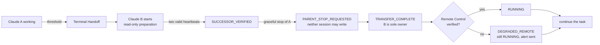
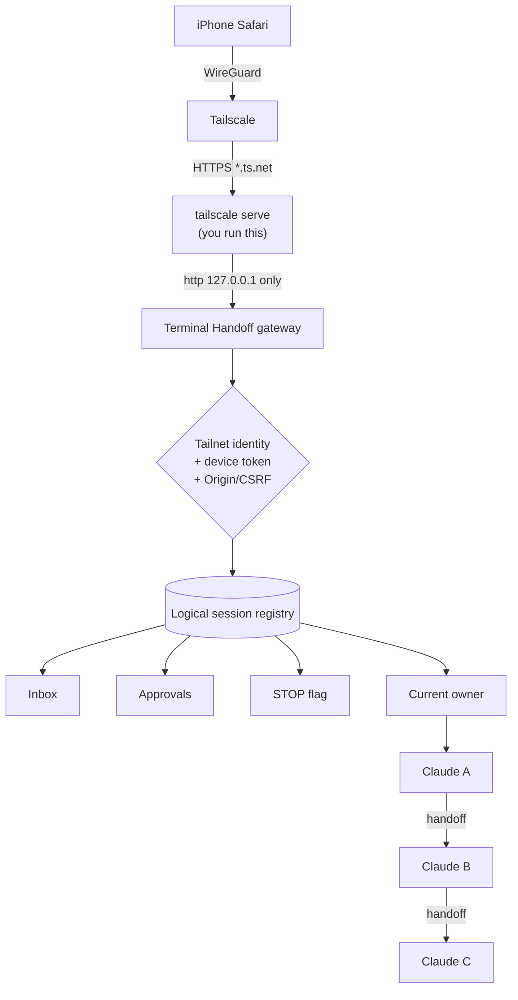
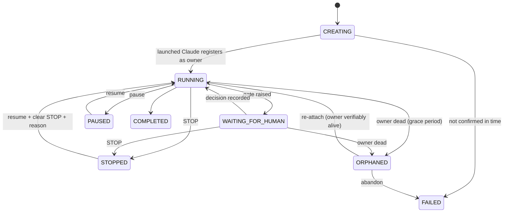
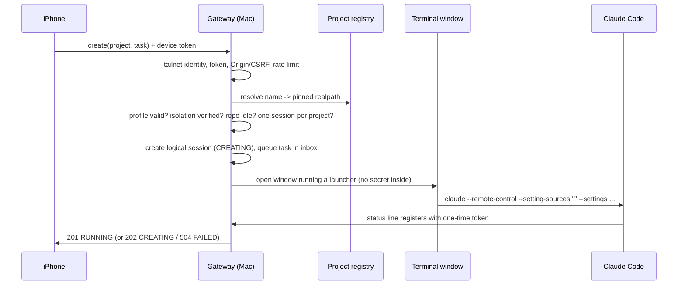

# Remote session control

Terminal Handoff can hand a session over to a successor **and** be steered from
an authorised phone while your Mac does the work. This document is the complete
description: architecture, threat model, set-up, behaviour and limits.

> **Status.** Implemented, tested (581 tests) and accepted on a physical iPhone
> on 2026-09-20; see [ACCEPTANCE.md](ACCEPTANCE.md). Nothing starts a network
> service unless you run `remote serve`, and nothing is published to Tailscale
> unless you run `tailscale serve` yourself.

## Contents

1. [What it is, and what it is not](#what-it-is-and-what-it-is-not)
2. [Automatic continuation](#automatic-continuation)
3. [Architecture](#architecture)
4. [Logical sessions](#logical-sessions)
5. [Human gates and approvals](#human-gates-and-approvals)
6. [Terminal Handoff gates versus Claude permission prompts](#terminal-handoff-gates-versus-claude-permission-prompts)
7. [Instructions, the inbox and waking Claude](#instructions-the-inbox-and-waking-claude)
8. [STOP and pause](#stop-and-pause)
9. [Project registry](#project-registry)
10. [Permission profiles and isolation](#permission-profiles-and-isolation)
11. [Starting a session from the phone](#starting-a-session-from-the-phone)
12. [Dead-owner detection and recovery](#dead-owner-detection-and-recovery)
13. [Degraded remote control](#degraded-remote-control)
14. [Network and authentication](#network-and-authentication)
15. [Threat model](#threat-model)
16. [Persistent security state](#persistent-security-state)
17. [Set-up, enrolment and rollback](#set-up-enrolment-and-rollback)
18. [Limitations](#limitations)
19. [Troubleshooting](#troubleshooting)

## What it is, and what it is not

The phone controls **Terminal Handoff and registered agent sessions**. Claude
Code always runs on the Mac, inside a repository the Mac's own registry names,
under the Mac's own Claude login. The phone never receives a shell, a terminal,
a path, a PID or a Claude credential. There is no endpoint that accepts a
command.

## Automatic continuation

A successful handoff means *continue the existing task*. After ownership has
transferred, the successor verifies Remote Control, then resumes the unfinished,
already-authorised work without asking permission to continue.


```mermaid
flowchart LR
    A[Claude A working] -->|threshold| T[Terminal Handoff]
    T --> B[Claude B starts<br/>read-only preparation]
    B -->|two valid heartbeats| V[SUCCESSOR_VERIFIED]
    V -->|graceful stop of A| X[PARENT_STOP_REQUESTED<br/>neither session may write]
    X --> C[TRANSFER_COMPLETE<br/>B is sole owner]
    C --> R{Remote Control<br/>verified?}
    R -->|yes| G[RUNNING]
    R -->|no| D[DEGRADED_REMOTE<br/>still RUNNING, alert sent]
    G --> W[continue the task]
    D --> W
```

Continuation is **never automatic approval**. The successor stops only at a
genuine human boundary (see [Human gates](#human-gates-and-approvals)). The
existing single-owner protections are unchanged: only `TRANSFER_COMPLETE` gives
the successor ownership, the parent is stopped with one graceful signal to a
re-proved process, and duplicate or forged transfers are refused.

Successor phases are recorded on the transfer record:
`PREPARING_SUCCESSOR`, `SUCCESSOR_READY`, `OWNERSHIP_TRANSFERRING`,
`SUCCESSOR_OWNER`, `REMOTE_CONTROL_VERIFYING`, `RUNNING`, `WAITING_FOR_HUMAN`,
`DEGRADED_REMOTE`, `FAILED`.

## Architecture


```mermaid
flowchart TB
    P[iPhone Safari] -->|WireGuard| TS[Tailscale]
    TS -->|HTTPS *.ts.net| SV["tailscale serve<br/>(you run this)"]
    SV -->|http 127.0.0.1 only| GW[Terminal Handoff gateway]
    GW --> AUTH{Tailnet identity<br/>+ device token<br/>+ Origin/CSRF}
    AUTH --> REG[(Logical session registry)]
    REG --> INBOX[Inbox]
    REG --> GATES[Approvals]
    REG --> STOPF[STOP flag]
    REG --> OWN[Current owner]
    OWN --> CA[Claude A]
    CA -->|handoff| CB[Claude B]
    CB -->|handoff| CC[Claude C]
```

The **logical session** is the durable control object. Claude processes are
disposable workers beneath it. The phone addresses a `logical_session_id`;
Terminal Handoff decides who the current legitimate owner is. The phone never
addresses a PID.

## Logical sessions

Each is a private JSON file `~/.claude/terminal-handoff/logical/ls_<24 hex>.json`
holding: project, branch, state, the owner (Claude session, generation, fencing
`epoch`, verified process binding), the STOP and pause flags, the instruction
inbox, approvals, Remote Control health, recent output and history.

**Ownership is fenced.** Every ownership change increments `owner_epoch`.
Ownership moves only when a `TRANSFER_COMPLETE` transfer names the registered
owner as its parent. Inbox reads, acknowledgements, approval consumption and
output can be performed only by the current owner at the current epoch, so a
stale owner is refused everywhere.


```mermaid
stateDiagram-v2
    [*] --> CREATING
    CREATING --> RUNNING: launched Claude registers as owner
    CREATING --> FAILED: not confirmed in time
    RUNNING --> WAITING_FOR_HUMAN: gate raised
    WAITING_FOR_HUMAN --> RUNNING: decision recorded
    RUNNING --> PAUSED: pause
    PAUSED --> RUNNING: resume
    RUNNING --> STOPPED: STOP
    WAITING_FOR_HUMAN --> STOPPED: STOP
    STOPPED --> RUNNING: resume + clear STOP + reason
    RUNNING --> ORPHANED: owner dead (grace period)
    WAITING_FOR_HUMAN --> ORPHANED: owner dead
    ORPHANED --> RUNNING: re-attach (owner verifiably alive)
    ORPHANED --> FAILED: abandon
    RUNNING --> COMPLETED
```

`REMOTE DISCONNECTED` is not a state: the phone being offline changes nothing
about the session. Remote Control health is a separate field
(`healthy`, `degraded`, `disabled`, `unknown`). `HANDOFF FAILED` is a transfer
state (`TRANSFER_FAILED`), in which the parent keeps the work.

## Human gates and approvals

The agent stops before an action that needs a human and asks:

```
session gate --reason "<why>" --requested-action "<the exact action>"
```

The state becomes `WAITING_FOR_HUMAN`, one notification is sent (never repeated
for the same open request) and the phone shows:

```
APPROVAL REQUIRED
Project: Nova
Requested action:  Restart the Nova production service after deploying commit abc123.
Reason:            The updated service cannot take effect until restarted.
[ DENY ]   [ APPROVE ]
```

An approval is bound to the **logical session**, the **approval id**, the
**exact action**, the **owner epoch**, a **nonce** and an **expiry** (default 6
hours, `CLAUDE_TERMINAL_HANDOFF_APPROVAL_TTL`).

| Situation | Result |
|---|---|
| Decision with the wrong nonce, id or session | refused |
| Decision made against an older owner epoch | refused as **stale**; the phone reloads and shows the same action again |
| Second approve/deny for the same request | refused (`not pending`); the first decision stands |
| Approved, then `consume` twice | second consume refused: an approval runs **once** |
| Consumed with different wording of the action | refused: *request a new approval* (whitespace-only differences are not a change) |
| Agent asks for a different action while one is open | the old request is superseded; only the new one can be approved |
| Expired | cannot be decided or consumed |
| Pending during a handoff | survives, re-bound to the new epoch; must be re-viewed before it can be decided |
| **Approved but unused** during a handoff | **invalidated**: the successor must ask again |
| STOP active | cannot be consumed |
| Session ORPHANED / ended | no decisions accepted |

The agent cannot resume its own gate: `continuation resume` is refused while a
linked approval is undecided.

## Terminal Handoff gates versus Claude permission prompts

These are two different things.

* A **Terminal Handoff human gate** is an authority boundary the agent
  *chooses to stop at*. The phone can answer it, remotely, with the semantics
  above.
* A **Claude native permission prompt** is Claude Code's own tool-permission
  dialog. There is **no supported interface** to answer it from outside, and
  Terminal Handoff does not pretend otherwise: it never types into a terminal,
  never uses AppleScript to send keys, never writes to a PTY and never speaks
  Claude's internal socket protocol.

A Terminal Handoff approval therefore does **not** answer a native prompt. If a
remote session reaches a native prompt for something outside its allowed tools,
it waits for you to answer it in the terminal or through Claude's own Remote
Control (where Claude supports that). This is why permission profiles exist:
routine work is pre-allowed so an unattended session rarely meets a prompt.

## Instructions, the inbox and waking Claude

An instruction from the phone is appended to the logical session's **durable
inbox**: ordered (`seq`), timestamped, uniquely identified, deduplicated by
request id, and audit logged. The inbox is the only source of truth.

* Delivery is to the **current owner only**, at the current epoch.
* Delivered-but-unacknowledged instructions are offered again after a lease
  (10 minutes) and are returned to the queue if ownership changes.
* Instructions sent during a handoff, while Claude is busy, while STOPPED, or
  while the phone is offline are never lost.

### Waking

Claude Code has **no supported interface** for an external process to message
an idle interactive session. The peer socket in `~/.claude/sessions/*.json` is
undocumented for external use, and keystroke injection is refused. So the
agent stays reachable by *blocking* in a supported way:

```
session wait --timeout 540      # a Bash tool call, at most ~10 minutes
```

It returns the moment work arrives for the current owner: instructions, an
approval decision, or STOP/resume. While blocked it costs no model tokens. It
polls a local file every 1 s when the session was recently active, every 3 s
when idle, and every 5 s when halted, and is bounded (590 s), after which the
agent simply calls it again. A stale owner's `wait` returns `STOP`.

A `Stop` hook (documented Claude Code contract: exit code 2 keeps Claude
working) stops the agent from ending its turn while work is waiting. The UI
shows whether Claude has checked in recently ("Claude is listening" versus
"busy or away; it will see new instructions at its next check").

If the agent is not in a `wait` loop (busy in a long tool call, or its turn
ended without one) the instruction stays pending and is picked up at its next
check. **Delivery is guaranteed; latency is not.**

## STOP and pause

`STOP` belongs to the **logical session**, not a PID.

* **Cooperative:** inbox delivery, gate requests, approval consumption and
  `wait` all refuse or return `HALT`. The agent is told to do no further
  autonomous mutation and never to clear STOP.
* **Persistent:** it survives handoffs to successors, Terminal Handoff
  restarts and owner death. A handoff never clears it.
* **Hard backstop (optional):** `--hard` sends one graceful `SIGTERM`, only
  after re-proving the recorded process binding (same start time, same
  executable, same user). It never sends `SIGKILL`, never takes a PID from a
  caller, and does nothing if the binding cannot be proved. It reuses the
  existing single signalling call.
* **Deliberate resume:** clearing STOP needs `clear_stop` **and** a reason. A
  plain resume is refused. Pause is separate and cannot downgrade a STOP.

The cooperative layer depends on the agent obeying; the hard backstop covers a
misbehaving one when a process binding exists.

## Project registry

The phone sends a **name**. The Mac resolves it.

```
terminal-handoff project add nova "$HOME/Nova"
terminal-handoff project list
```

Names must match `^[a-z0-9][a-z0-9-]{0,39}$`. A registered entry keeps the path
as supplied and a **pinned realpath**; at launch the path must still resolve
to that realpath, so a swapped symlink is refused. `/`, your home directory and
Terminal Handoff's own directory cannot be registered. The API rejects any
request field other than `project`, `task` and `request_id`.

## Permission profiles and isolation

A remote project must have an explicit permission profile. There is no default
and no fallback: **no valid profile means no unattended launch.**

```
terminal-handoff project permissions template nova     # a starting point, never applied
terminal-handoff project permissions edit nova         # opens $EDITOR, validates on save
terminal-handoff project permissions validate nova
terminal-handoff project enable-remote nova            # deliberate, and only if valid
```

```json
{
  "profile": "development",
  "allow": ["Read", "Grep", "Glob", "Bash(git status:*)", "Bash(git diff:*)"],
  "deny": [],
  "human_gate": ["production deployment", "production restart", "rollback",
                 "destructive filesystem operation", "credential changes",
                 "security configuration changes", "irreversible external action"]
}
```

Use `Edit(<path>)` for file changes: Claude reports that `Write(...)` allow rules are
not matched and only `Edit(path)` rules are (they cover all file-editing tools), so
validation rejects `Write`, `MultiEdit` and `NotebookEdit` rules.

Validation rejects: unknown keys (so no `defaultMode`, permission mode or
bypass can be set); bare `Bash`, `Bash(*)` and unrestricted `Edit`/`Write`;
pre-approval of `rm`, `sudo`, `git push`, `curl`, `kubectl`, `docker`, deploy
CLIs and similar; and any profile that drops a mandatory human gate. A hash of
the validated profile is stored; changing it disables remote launch until you
re-enable it, and tampering fails closed.

### Your Claude permission mode is preserved

Terminal Handoff never chooses or overrides your permission mode.

* It never passes `--permission-mode` or `--dangerously-skip-permissions`
  (both stay on the forbidden list).
* `remote configure --permission-mode auto` records the mode you want remote
  sessions and their successors to keep (`auto`, `default`, `acceptEdits` or
  `plan`). If you set none, your own `permissions.defaultMode` is followed. It is
  written as `permissions.defaultMode` in the per-session settings file, which
  successors inherit, so the mode survives every handoff. `bypassPermissions` and
  `dontAsk` are never carried.
* For `auto`, your own `autoMode` block (classifier environment and `soft_deny`
  rules) is copied into the session file, because the user settings that hold it
  are not loaded in an isolated session. If you chose no mode, Auto Mode is
  explicitly *not* enabled implicitly.
* Ordinary local handoffs launch an unisolated successor, so your own settings,
  including Auto Mode, apply exactly as they do for any session you start.
* **Terminal Handoff STOP and `WAITING_FOR_HUMAN` still take precedence** over any
  mode, because they are cooperative gates the agent stops at, not permission rules.

Consequence to understand: in Auto Mode Claude's classifier, not the allow list,
decides most prompts, so a permission profile is a narrower *default* rather than a
hard boundary. Terminal Handoff's own gates, STOP and the project registry remain in
force.

**"Accept edits on" in a status bar is Claude's own behaviour, not Terminal
Handoff.** Terminal Handoff has no code path that sets a mode other than writing
your chosen `defaultMode`, and a test asserts it never passes a mode on argv.
Claude lets the mode be cycled at runtime (Shift+Tab) and by clients attached
through Remote Control; one launched session showed "accept edits on" although it
started in the default mode, and no Terminal Handoff action changed it.

### Why `--settings` alone is not a boundary

`--settings <file>` **adds** to your user, project and local settings; lists such
as `permissions.allow` are combined. Broader rules you already have would stay
effective. So a remote session is launched with

```
--setting-sources "" --settings <per-session file>
```

so that **only** the profile applies (managed/organisation settings cannot be
excluded and still apply). Because your other settings are then not loaded, the
per-session file also carries the Terminal Handoff status line and the `Stop`
hook, and sets `permissions.disableBypassPermissionsMode` to `"disable"`. Your own
settings files are never edited. Your chosen permission mode is carried across
(see below).
Successor sessions in the chain inherit the same file.

`--setting-sources` appears in `claude --help` but not in the published
documentation, so it is **verified on your machine** rather than assumed:

```
terminal-handoff remote verify-isolation
```

runs two small `claude -p` probes in a throwaway directory (a project allow rule
must be *blocked*, and the profile file alone must be able to *grant*), and
records the result **per Claude version**. Until it passes for the installed
version, remote launch returns `isolation_unverified` (fail closed).

You do not need to run it by hand after a Claude upgrade. The first remote
launch on a Claude version with no valid record runs the same verification
automatically, before the launch continues:

* a **pass** is recorded for that exact version string and reused by every
  later launch (no re-probe);
* a **failure, error or timeout blocks the launch**, and the
  `isolation_unverified` reason names the failed check. A failure is not
  recorded, so the next launch verifies again;
* **no future version is implicitly trusted**: each new patch version is
  verified on its own, and a malformed, partial or mismatched record is
  re-verified rather than trusted.

Only one process verifies a given version at a time (a per-version lock);
concurrent launches for it wait for and reuse the result, and other versions
and other isolation state are not blocked while a probe runs. The probe takes
up to a few minutes, so the first launch on a new version is slow; a launch
that waits more than 330 seconds for another launch's verification refuses.
`remote verify-isolation` still works for verifying ahead of time.

Trade-off: a remote session does not load the repository's own
`.claude/settings*.json` (including any project hooks). `CLAUDE.md` files still
load.

### The Nova operator profile (one project only)

On 30 September 2026 the owner decided that sessions of the `nova` project may
ship without him at a Terminal. That grant is an **elevation** checked in code,
not a looser profile. It follows these rules:

- **It applies to one project only.** A profile may ask for it by name with
  `"elevation": "nova-operator"` (and must be named `nova-operator`). It
  validates only when stored for the project registered as `nova`. For any
  other project, or when copied into another project's entry, it is refused. A
  Grok session on `nova` gets the profile with the elevation removed.
- **It waives only the deployment gates.** It may omit the `production
  deployment`, `production restart` and `rollback` gates. It must then carry the
  narrower gate `production deploy, restart or rollback by any path other than
  nova-ops deploy/rollback/privd`. All other mandatory gates stay.
- **It must deny the direct routes around `nova-ops`:** `Bash(git push:*)`,
  `Bash(gh pr merge:*)`, `Bash(gh api:*)`, `Bash(git remote:*)` and
  `Bash(sudo:*)`. `UNALLOWABLE_COMMANDS` is unchanged, so none of these can be
  allow rules either.
- **What the session gains at launch.** Terminal Handoff adds allow rules for
  `terminal-handoff.py nova-ops push|merge|deploy|rollback|status|privd`. These
  run from the installed file, which a Nova session cannot edit. Deployment
  tooling always comes from a clean `git archive` of a commit in origin/main,
  never from a checkout the session can edit. The session prompt lists the
  commands.

Register it once, locally:

```sh
TH="python3 ~/.claude/terminal-handoff/terminal-handoff.py"
$TH project add nova /Users/johngavin/Nova
$TH project permissions edit nova --from-file docs/nova-operator-profile.json
$TH project enable-remote nova
$TH project list        # "permissions": "valid"
```

What `nova-ops` checks:

| Command | Checks |
| --- | --- |
| `push` | Only a checkout or worktree of the `nova` project. Only the checked-out feature branch, never `main`/`master` or a detached HEAD. The refspec is explicit and non-forcing (`refs/heads/B:refs/heads/B`). |
| `merge PR --sha HEAD` | The PR is OPEN, not a draft, based on `main`, and not from a fork. Its head equals the SHA given. The review decision is not `CHANGES_REQUESTED`/`REVIEW_REQUIRED`. The merge state is `CLEAN`. "Architecture Validation" and "Safety Boundary Gate" are green and no other check is failing or running. The merge uses `gh pr merge --merge --match-head-commit`, never `--admin`. |
| `deploy SHA --instruction "..."` | A full 40-character SHA, contained in origin/main after a fetch, with green CI (it waits up to `--wait-ci` seconds). The tool at that SHA is extracted with `git archive`. It runs `nova_deploy.py authorize` (which records the quoted instruction and the session), then `deploy`, then `verify`. Nova's lock, ledger, merged check, health proof and automatic rollback all apply. |
| `rollback SHA --instruction "..."` | The same, using the tool at the origin/main tip. The Nova tool accepts only a release its ledger shows was deployed and proven. |
| `privd VERB ...` | `sudo -n /Library/Nova/bin/nova-privd` with only `status`, `list-pending`, `request-mint`, `deploy`, `rollback` and `restart`, each with validated flags. The verbs that need a password and a terminal are never reachable. |

The owner's quoted instruction is **attribution and audit evidence, not a
security boundary**. A process running as the same macOS user can still write a
receipt or move a pointer by hand. Closing that requires the root-owned
`nova-privd` authority.

## Folder trust (one-time human step per project)

Claude Code asks *"Is this a project you created or one you trust?"* the first
time it opens a folder. An unattended launch cannot answer that, and Terminal
Handoff never answers it for you (no keystroke injection, no editing of Claude's
own configuration). Before a project can be launched remotely, open Claude in that
folder **once** yourself and choose *Yes, I trust this folder*. Until then a remote
create is reported as `FAILED` ("the Mac did not confirm the session started")
and the Terminal window shows the trust question.

## Starting a session from the phone


```mermaid
sequenceDiagram
    participant Ph as iPhone
    participant G as Gateway (Mac)
    participant R as Project registry
    participant T as Terminal window
    participant C as Claude Code
    Ph->>G: create(project, task) + device token
    G->>G: tailnet identity, token, Origin/CSRF, rate limit
    G->>R: resolve name -> pinned realpath
    G->>G: profile valid? isolation verified? repo idle? one session per project?
    G->>G: create logical session (CREATING), queue task in inbox
    G->>T: open window running a launcher (no secret inside)
    T->>C: claude --remote-control --setting-sources "" --settings ...
    C->>G: status line registers with one-time token
    G->>Ph: 201 RUNNING (or 202 CREATING / 504 FAILED)
```

Success (`201 RUNNING`) is returned only after the launched Claude has
registered as owner. The task text is stored exactly (see [Large prompts](#large-prompts))
and read by the agent as data; it never reaches a shell or argv. Two modifying agents never share a
physical working tree: a stale holder is reconciled first (see
[Stale sessions](#stale-sessions-and-project_in_use)), and a healthy one no longer blocks a Git project, the new
session gets its own isolated worktree (see [Concurrent sessions](#concurrent-sessions-on-one-project)).

## Large prompts

The New Session task can be up to **524,288 bytes** of UTF-8 (about 512 KiB; hundreds of thousands of
characters). It is sent in the JSON request body (never a URL), and:

* **Stored exactly.** `tasks/<logical-session>.task`, written to a temporary file, fsynced, renamed into place with
  mode 0600 inside a 0700 directory, then read back and hashed. Nothing is trimmed, normalised or truncated; only NUL
  and unpaired surrogates (which cannot be stored) are refused. It is kept with the session record for as long as the
  record exists: records are archived, not deleted, and there is no purge, so the payload is retained (up to 512 KiB
  per session, and it may contain whatever you pasted). The launch-artifact sweep removes only `.tmp-` crash debris.
* **Delivered by reference.** A small task (up to 8,000 characters and up to 12,000 once JSON-escaped, which is how
  `session inbox` prints it) is queued inline in the inbox, byte-exact. A larger one is queued as a short pointer with
  its size and SHA-256. **Claude** reads it with
  `session task --part N` (N from 1 to the part count); each part is at most 16,000 characters, printed verbatim
  between a header line and a footer line so it fits in one tool result, and the concatenation is exactly the
  submitted text. `session task` with no `--part` shows the size, the hash, and which parts have been read; the
  session page shows the same. `session inbox` reports `task_progress`, and `session ack` of a stored task is
  **refused until every part has been read** (a real model was seen to skip parts while still answering). Only the
  session's current owner can read its task. **Grok** is pushed the exact stored text as the ACP prompt after its hash is
  verified; a missing or altered payload is refused, never sent partly.
* **A large prompt is never in argv, a URL, a launch script, a log, an event or a notification.** The launch is the
  same short bootstrap as before. The session record holds only the pointer and the size and hash; a small inline task
  is in the inbox record exactly as before, and the first line of any task is the session's display title (control,
  bidi and zero-width characters removed), as it always was.
* **Bounded.** The request body limit for session creation is 4 MiB (headroom for JSON escaping); every other
  endpoint stays at 32 KiB. A task over 524,288 bytes, or a body over its limit, is rejected before anything
  launches with the byte and character counts. A very large task is still limited by the agent's context window:
  512 KiB is roughly 130,000 tokens.
* **Phone.** The Task box is large and monospaced and shows characters, bytes and lines as you paste. It refuses to
  send over the limit, keeps your text when a launch is rejected (and retries with a fresh request id), and
  confirms that the whole task was accepted. The draft is kept in memory only, so leaving the page and coming
  back within the same tab keeps it, but a reload does not.

Follow-up instructions (`Tell Claude...`) keep their 8,000-character limit.

## Stale sessions and `project_in_use`

A launch is refused with `project_in_use` only when a session holds the project and no safe isolated workspace can
be made for the new one. Before deciding, Terminal Handoff reconciles the sessions holding it, inside the create lock,
using the same owner-health evidence as `session recover`:

| Existing session | Result |
|---|---|
| ORPHANED, and a *fresh* check proves the owner conclusively dead | **abandoned automatically** (`by auto:project-launch`); the same launch continues; the response lists it in `auto_recovered` |
| RUNNING/PAUSED/etc. whose owner is conclusively dead | two fresh "dead" verdicts a settle apart, then ORPHANED (never on "unknown"; no alert), then abandoned as above |
| RUNNING with a live owner, a session mid-handoff, or one still inside its launch window (CREATING) | a **healthy holder**: never touched, signalled or killed. A Git project gives the new launch its own workspace; a project that cannot be isolated blocks and says why |
| ORPHANED but the owner is alive, or an owner that is "unknown" | **ambiguous: blocks** and says why; recover or abandon it deliberately |
| recovery refused or failing, ownership changed or the owner no longer provably dead at the moment of recovery | **ambiguous: blocks**; nothing is changed |
| a CREATING session whose launch window passed without registering | failed as before |

Only sessions of the requested project are examined or changed. Two racing launches cannot both recover or both
take the project: one wins, the other is told which session now holds it. The refusal names the holder, for example
`Project 'nova' is in use by session Nova Health (RUNNING, Claude Code). Its owner is alive.`

## Concurrent sessions on one project

A healthy session occupying a project does not stop another launch on it. The rules, in order:

* a dead ORPHANED owner: auto-recovered, and the launch uses the project directory (unchanged);
* a **healthy** holder of the project directory and a **Git project**: the new session gets its own **isolated
  worktree**, and the holder is not touched in any way;
* **ambiguous** ownership: fail closed;
* a project that **cannot be isolated safely**: fail closed, with the actual reason.

**The workspace.** `git worktree add -b th/<project>/<session> <root>/<project>/<session> <base>`, where `<root>` is
`.th-worktrees` beside the project directory (or `worktree_root` in `remote/config.json`, which may not be inside the
project). It is created with Git hooks disabled, then verified (path, base commit, branch, same repository); anything
that fails is undone and reported as `workspace_unavailable` with the reason, never as a bare `project_in_use`. Two
launches never share a path or a branch (both carry the session id), and an existing path is never reused. A Git worktree
of a project you already trusted does not raise Claude's folder-trust prompt.

**The base commit** is the project's own HEAD when it sits on the default branch (or is detached); when the project
directory is on another branch (another session's feature branch), the default branch (`origin/HEAD`, `origin/main`,
`origin/master`, `main`, `master`) is used instead and the phone is told. When no default branch can be identified the
current branch's HEAD is used and the phone is told that too. The commit is verified to exist. If the project's parent
directory is not writable, set `worktree_root` in `remote/config.json`. The base SHA,
base ref, branch and workspace path are recorded on the logical session, and `remote/workspaces.json` records which
session owns which worktree.

**Uncommitted work in the project directory** is never copied and never dropped. The new workspace starts from the
committed base; the phone is told how many modified, staged and untracked files (counts only) are not in it. Ignored files
(for example `.env`, `node_modules`) and submodule contents are not in a new worktree either.

**Permissions.** The project's registration and permission profile are unchanged. The isolated session runs with the same
profile pointed at its own workspace: an absolute allow rule that names the project directory is re-targeted at the
workspace (it gains no access to the project directory), a deny rule is kept as written **and** re-targeted (only the
`//absolute` form, on whole path boundaries: `//x/app` is not `//x/app-old`), and `Edit` and `Write` on the project
directory are denied to it, so it cannot edit the tree another session occupies. This is a permission rule, not a sandbox:
a Bash command can still reach any path the profile's Bash rules allow, and the agent's prompt tells it not to. The agent's
prompt says it is in an isolated worktree and where the main workspace is.

**Phone.** No `project_in_use` for a healthy holder. The launch continues and the page says, for example: *Nova Health is
already using this project. A separate isolated workspace was created for PlanGuard.* with the branch, the base, and any
warning. The task text is untouched. The session page shows the workspace kind, branch and base.

**Cleanup.** `session workspace-cleanup` (and a periodic sweep) removes a worktree only when **all** of these hold: its
session is COMPLETED or FAILED for at least ten minutes (a STOPPED or PAUSED session may be resumed, so its workspace
stays until it ends); its owner is *provably dead* (an "unknown" owner keeps it) and **no process has its working directory
inside it** (if that cannot be checked, it stays); git lists it as a worktree of the project, it is under the root recorded
when it was created, and the ownership index says this session owns it; no git operation is in progress; HEAD is still **on
the session branch** (commits on a detached HEAD or another branch could otherwise be lost); no file is hidden from
`git status` (skip-worktree / assume-unchanged); and it holds **nothing** uncommitted: no modified, staged, untracked or
unmerged file, and no ignored file other than provably regenerable caches: `.DS_Store`, `*.pyc` inside a `__pycache__`, and
anything inside `.pytest_cache`, `.mypy_cache`, `.ruff_cache` or `node_modules`, and only where the cache sits under a
directory that holds tracked files (an ignored data directory that merely contains a cache-named folder is kept). It uses
`git worktree remove` **without** `--force`, and the session branch is never deleted, so commits made on it always survive.
Anything else is kept and the reason recorded (`kept_dirty`, `kept_ignored`, `kept_owner_alive`, `kept_unsafe`). Nothing
removes a kept workspace for you: deal with it by hand, then run the command again.

## Session names

A session can be given a **display name** when it is created from the phone (optional; blank keeps
the default naming) and renamed later from the session page. The name is metadata only: it is
stored on the logical session and never changes its ID, owner, epoch, process binding, project,
permissions, inbox, approvals, STOP state or handoff chain. It persists across page refreshes,
disconnects, gateway restarts and every A → B handoff, and each rename is recorded in the
session history and the audit log with the old and new names. Names are 1–60 characters of
letters, numbers, spaces and `. , ' & ( ) + # : ! ? -`; anything that looks like a path, a command
or an identifier (for example `../x`, `a/b`, `$(id)`, `ls_…`) is refused, and the UI only ever
shows a name as text. A custom name given at creation also labels the Claude session (successors
get the usual generation suffix); a later rename changes the phone label only, not the terminal
title.

## Mobile text entry

The instruction box is a plain native `textarea`. The page never reads or writes the clipboard,
never calls `focus()` or changes the selection, and registers no `paste`, `input` or
`beforeinput` handler. While the box has focus, and for eight seconds after it loses it (iOS can
blur it while its own paste dialog is up), polling changes nothing on the page except an urgent
change (state, an approval, STOP, orphaned). The iOS "Pasting from <device>…" dialog is Apple's
Universal Clipboard transfer, which a web page cannot start or stop.

## Dead-owner detection and recovery

A session must not keep showing `RUNNING` after its owner died. Every 15 s the
gateway re-checks each active session's owner using independent signals:

* the recorded process binding, re-proved;
* Claude's own live session record for that session ID;
* a status-line snapshot within the last 30 s.

Any positive signal means *alive*. It is *dead* only when the binding proves the
process is gone or reused **and** nothing else shows the session alive. *Unknown*
is never treated as death. Death must persist for 3 checks over 60 s
(`CLAUDE_TERMINAL_HANDOFF_OWNER_GRACE`) before the state becomes `ORPHANED`,
which sends one alert. A parent that a completing handoff is *meant* to stop is
not orphaned.

`ORPHANED` is never repaired automatically and **no replacement agent is
launched**. The one automatic step is at launch: an ORPHANED session whose owner is conclusively dead no longer
blocks a new launch on its project, it is abandoned and the launch continues (see
[Stale sessions](#stale-sessions-and-project_in_use)). Otherwise you choose: **Re-check** (re-attach, only if the owner is now
verifiably alive) or **Abandon** (`FAILED`). STOP, the inbox and pending
approvals are preserved throughout. Relaunching a replacement agent is not
implemented.

### Terminal Handoff restart

`remote serve` runs recovery at start: it reloads every logical session,
revalidates the project registration, expires stale approvals, and checks each
owner twice. A session whose owner is **not verifiably alive** becomes
`ORPHANED`, not `RUNNING`. `terminal-handoff session reconcile --startup` does
the same on demand. **A Mac reboot is not recovered**: Claude processes do not
survive it, so those sessions are simply orphaned.

## Degraded remote control

Remote Control health comes from Claude's own live session record (a registered
bridge). It is checked at launch, by the agent's `session check`, and again for
every new owner after a handoff. If it fails the state is `degraded`, one alert
is sent with the reason, and the session **keeps running**: a healthy successor is
never killed for a channel fault. While degraded, a gate notification tells you
to return to the terminal instead. `CLAUDE_TERMINAL_HANDOFF_REMOTE_CONTROL=0`
disables the `--remote-control` flag and reports the state as `disabled`.

## Network and authentication

**Tailscale only.** Never use Tailscale Funnel, and never publish the port
another way. The gateway:

* binds `127.0.0.1` only and refuses to start otherwise;
* refuses to start unless `tailscale status --json` shows Tailscale running and
  this Mac's name equal to the configured `allowed_host`;
* refuses every request whose `Host` is not that name, with the configured
  `public_port` if one is given (DNS-rebinding defence), and requires the `Origin`
  of a change to be exactly `https://<host>[:<public_port>]`;
* refuses to start on a local port that an existing `tailscale serve` mapping
  already proxies to (read-only check), so it is never exposed by accident;
* requires a `Tailscale-User-Login` (set by `tailscale serve`) on an allowlist.

**Device tokens** (second layer): 256-bit, generated on the Mac, stored only as a
SHA-256 hash, revocable, expiring (14 days by default, 90 maximum) and shown once
through a single-use enrolment code valid for 10 minutes. Browsers keep the token
in a `__Host-` cookie (`Secure; HttpOnly; SameSite=Strict`); scripts never see
it. Cookie-authenticated changes need a per-device CSRF token **and** an exact
`Origin`; bodies must be `application/json`. Every request re-reads the device
file, so revocation and expiry take effect immediately, including on an open
browser session.

CLI: `remote configure`, `remote enroll-device`, `remote list-devices`
(name, created, expiry, revoked, last used), `remote revoke-device`,
`remote check`, `remote serve`, `remote verify-isolation`.

The interface is served with `Content-Security-Policy: default-src 'none';
script-src 'self'; style-src 'self'; ...`, no inline script, and every piece of
dynamic text is set with `textContent`.

## Threat model

| Threat | Mitigation |
|---|---|
| Internet exposure | loopback bind; Tailscale-only publication; startup fails closed; Funnel forbidden |
| Stolen or lost phone | per-device revocation, 14-day expiry, no shell surface, STOP available from any other device |
| Token theft from the Mac | only hashes stored; tokens never logged or returned in bodies |
| Cross-site request | `Origin` check, CSRF token for cookies, JSON-only bodies, `SameSite=Strict` |
| DNS rebinding / local web page | `Host` allowlist; header identity only trusted on loopback |
| Path traversal / symlink swap | names only; regex; pinned realpath re-checked at launch |
| Command / prompt injection through task text | data in a private per-session payload file, read part by part or pushed over ACP; never shell, argv, URL, log or title; agent told instructions never approve gates |
| Arbitrary shell or PID control | no such endpoint exists; body fields are whitelisted; handler contains no process or shell call |
| Replay | request ids (durable dedupe for instructions, creation and approvals); approval nonce, epoch, one-shot consume |
| Stale owner / split brain | fenced owner epoch; single `TRANSFER_COMPLETE` ownership gate; one session per project |
| Permission escalation | validated profiles; `--setting-sources ""`; no bypass flags; isolation verified per Claude version |
| Brute force | persistent lockout after 8 failures / 5 min; enrolment 5 / 10 min |
| Secret leakage | redaction of stored output; secrets never logged; launch token never on argv or in the script |
| Approval confusion | UI shows the exact action; wording change requires a new approval; native prompts are not answered |

**Security assumptions.** The Mac and your user account are trusted. A local
process running as you could forge the tailnet header, but still needs a device
token; it could also read your files, which is outside this design's scope. The
Tailscale control plane and your tailnet's ACLs are trusted. **Set Tailscale ACLs
so only your own devices can reach this Mac.**

## Persistent security state

Restarting the gateway must not reset a lockout or an attempt budget. A small
private file (`remote/security_state.json`, mode 0600, atomic and locked) keeps
authentication-failure lockouts, enrolment attempts and the limits on approvals,
session creation, STOP/pause/resume and recovery. It holds only timestamps and
keys made of the tailnet login and peer address, never a secret. General request
rate limiting stays in memory: losing it on restart only loosens throttling of
harmless reads. Replays are safe across restarts without a cache, because
instruction dedupe, creation dedupe and approval status are durable.

**Launch tokens.** The one-time launch token is stored server-side only as a
hash, expires in 5 minutes and is single use. The launcher script contains no
secret: it reads the token from a mode-0600 file and deletes both that file and
itself before Claude starts (the server removes leftovers after registration or
failure and sweeps stale files). The token must still reach the Claude process
so its status line can register; passing it on argv would expose it to `ps`, and
an environment variable is visible only to the same user. It is useless after
first use.

## Set-up, enrolment and rollback

Per-project prerequisites: register the project, validate its permission profile, open Claude once in the
folder and accept its trust question, then `project enable-remote`. The README's
[Installation and setup](../README.md#installation-and-setup) has the ordered checklist; the commands
below are the same ones.

Nothing below has been run against your live tailnet yet.

```sh
# 1. Register a project and its permission profile
terminal-handoff project add nova "$HOME/Nova"
terminal-handoff project permissions edit nova
terminal-handoff project permissions validate nova
terminal-handoff remote verify-isolation
terminal-handoff project enable-remote nova

# 2. Configure the gateway (loopback only)
terminal-handoff remote configure --host <mac>.<tailnet>.ts.net \
    --tailscale-user you@example.com --port 18790
terminal-handoff remote check            # prints a publish command that avoids your existing mappings
terminal-handoff remote serve            # foreground; nothing is published yet

# 3. Only when ready, publish on its OWN tailnet-only HTTPS port (never `tailscale funnel`).
#    Use the port `remote check` suggests; it is one that no other mapping uses.
tailscale serve --bg --https=<free-port> http://127.0.0.1:18790
terminal-handoff remote configure --public-port <free-port>

# 4. Enrol the phone
terminal-handoff remote enroll-device --name "Your iPhone"
#    On the phone, open https://<mac>.<tailnet>.ts.net/ , choose Enroll, enter the code.
```

**Rollback**, in this order:

```sh
tailscale serve --https=<free-port> off                  # unpublish ONLY this mapping
tailscale serve status                                   # confirm your other mappings are intact
terminal-handoff remote list-devices
terminal-handoff remote revoke-device --device d_XXXXXXXXXXXXXXXX
# stop the `remote serve` process
terminal-handoff session stop --logical-session ls_... --hard   # per active session
terminal-handoff project disable-remote nova
```

**Never run `tailscale serve reset`**: it removes *every* serve mapping on the Mac,
not just this one. Terminal Handoff refuses to start on a local port that an
existing `tailscale serve` mapping already publishes, so it cannot become
reachable by accident. Disabling `remote serve` does not affect ordinary local
handoffs.

## Limitations

* **Interactive Stop hook unverified**: it works in headless runs, and the durable inbox is the delivery guarantee.
* **Claude's runtime permission mode can change independently** of Terminal Handoff (see [decision 0005](decisions/0005-preserve-the-users-permission-mode.md)).
* **Auto Mode profiles are not an OS-level sandbox.**
* **A new project needs one-time Claude folder trust**, done manually.
* **Wake is delivered by a bounded long-poll**, not a push. If the agent is
  mid-task or not in a `wait` loop, latency is up to its next check.
* **`--setting-sources` is undocumented**; isolation is proven per Claude version
  by `remote verify-isolation`, and runs automatically on the first launch
  after a Claude upgrade (a failure blocks that launch). Managed
  settings cannot be excluded.
* **Native Claude permission prompts cannot be answered remotely** by Terminal
  Handoff; an unattended session that meets one waits for you.
* **Remote sessions do not load project or user settings**, including project
  hooks and user plugins.
* **STOP is cooperative** unless a process binding exists for `--hard`.
* **Relaunching an ORPHANED session, and Mac reboot recovery, are not
  implemented.**
* **One active remote session per physical working tree.** A Git project runs several concurrent sessions, each in its
  own worktree; a non-Git project, one that is not the top level of its repository, or one with no commits keeps a single writer.
* The interface polls (every 3–5 s while open); it is not a push channel. Alerts
  use the existing notification outbox.
* Rate limits other than the persistent ones are per process.
* Device expiry is absolute (no idle timeout).

## Troubleshooting

| Symptom | Check |
|---|---|
| `refusing to start: ... not configured` | `remote configure`; `allowed_host` must end in `.ts.net` |
| `private network check failed` | Tailscale is running and this Mac's name equals `allowed_host` |
| Page loads but shows *Not available from this network* | request lacks a tailnet identity; use `tailscale serve`, not another proxy |
| `401` for a known device | token expired or revoked: `remote list-devices`, enrol again |
| `429` | lockout or rate limit; wait, or check `security_state.json` windows |
| `isolation_unverified` | the automatic verification for the installed Claude version failed (the reason names the check): fix it, or run `remote verify-isolation` to see the probe |
| `permission_profile_required` | `project permissions validate <name>`, then `enable-remote` |
| `project_in_use` | a session holds the project and the new one cannot be given its own workspace: the message names the holder and says why isolation was not possible (not a Git repository, not the repository top level, no commits, ambiguous ownership). A dead ORPHANED holder is recovered automatically; a healthy holder in a Git project no longer causes this |
| `workspace_unavailable` | the isolated worktree could not be created; the reason is in the message and nothing was left behind |
| `413 task_too_large` / `payload_too_large` | the task is over 524,288 bytes (or the body over its limit); the message gives the counts. Shorten it: nothing is ever truncated |
| `504` on create | Terminal did not open a registered Claude in time; check Automation permission for Terminal |
| Session shows ORPHANED | the owner process is gone; **Re-check** if it has come back, otherwise **Abandon** |
| Instruction seems ignored | UI shows whether Claude is listening; it will read the inbox at its next check |
| Remote Control `degraded` | Claude's bridge was not registered; the session keeps running; check `/remote-control` in that session |
